# I cambiamenti ambientali indotti dall’uomo e le sfide della ricerca

## Benvenuti nell’Antropocene

Homo sapiens è presente sulla Terra da circa 200.000 anni, un tempo brevissimo se confrontato con l’età del nostro pianeta, ma con il crescente progredire delle capacità tecnologiche ha causato profondi cambiamenti dell’ambiente a livello globale. Peraltro, fino a tempi molto recenti le attività umane hanno contribuito in modo poco significativo ai cambiamenti dell’ambiente a livello globale, mentre da meno di due secoli a questa parte l’uomo ha iniziato a interferire con il funzionamento del Sistema Terra a una velocità che eccede di gran lunga quella dei processi naturali. L’entità, la scala spaziale e la velocità dei cambiamenti indotti dalle attività umane hanno raggiunto proporzioni mai verificatesi in precedenza. I processi ambientali indotti dalle attività umane ora eguagliano o eccedono quelli naturali, la loro scala spaziale è ormai quella globale e la velocità con cui questi cambiamenti hanno luogo è dell’ordine dei decenni, rispetto a una scala temporale di millenni caratteristica dei cambiamenti naturali. I cambiamenti dell’ambiente globale indotti dalle attività antropiche sono vari e sintetizzabili nei seguenti punti:

* circa il 50% della superficie terrestre è stata trasformato dalle attività umane, con pesanti conseguenze per la biodiversità, i cicli dei nutrienti, la struttura e biologia del suolo e il clima;
* più di metà delle riserve di acqua dolce vengono usate direttamente o indirettamente, dall’uomo, e le riserve acquifere sotterranee sono già state esaurite in molte aree del pianeta;
* la concentrazione di gas a effetto serra in atmosfera nell’ultimo secolo è cresciuta in modo esponenziale e ha raggiunto il livello più elevato degli ultimi 800.000 anni portando al riscaldamento del clima della Terra;
* gli habitat marini e costieri sono stati alterati in modo sostanziale e le zone umide si sono ridotte della metà;
* il 22% delle riserve ittiche conosciute è a rischio di estinzione, e un ulteriore 44% è al limite dello sfruttamento possibile;
* il livello di estinzione negli ecosistemi terrestri e marini sta rapidamente crescendo e la Terra si trova per la prima volta nella situazione in cui fenomeni di estinzione di molte specie viventi contemporaneamente sono causate dalle attività di una singola altra specie: quella umana. 

**Tabella 1**. Le principali attività umane responsabili dei cambiamenti globali nei diversi comparti e cicli del Sistema Terra e i bisogni della società e individuali che inducono tali cambiamenti. Questi bisogni sono a loro volta funzione di fattori sociali quali il mercato, le istituzioni, le legislazioni, i sistemi politici, i valori culturali.

| Ecosistemi terrestri | Deforestazione \(taglio delle foreste, incendi boschivi\), attività agricole \(p.es. preparazione dei suoli, uso di fertilizzanti, irrigazione, uso di anticrittogamici, selezione delle coltivazioni, ecc.\), uso del territorio | Fabbisogno alimentare, fabbisogno abitativo, attività ricreative |
| :--- | :--- | :--- |
| Atmosfera | Uso di combustibili fossili, uso del territorio, attività industriali, deforestazione | Esigenze di mobilità, fabbisogno alimentare e di beni di consumo |
| Acque | Costruzione di bacini, sistemi di distribuzione, smaltimento rifiuti | Fabbisogno idrico per uso umano diretto, per irrigazione e per processi industriali |
| Ecosistemi marini e costieri | Uso del territorio, uso delle risorse idriche sotterranee, tecniche di pesca, trattamento degli scarichi civili e industriali, urbanizzazione | Fabbisogno alimentare, attività ricreative |
| Biodiversità | Distruzione di habitat, introduzione di specie alloctone | Fabbisogno alimentare, attività ricreative |

Nei due secoli passati, sia la popolazione umana che la ricchezza economica complessiva a livello mondiale sono cresciute molto rapidamente. Questi due fattori hanno accresciuto in modo rilevante il consumo di risorse naturali in settori quali l’agricoltura e la produzione alimentare in generale, lo sviluppo industriale, il commercio, la produzione di energia, la mobilità, l’urbanizzazione e finanche le attività ricreative. Circa sei miliardi di persone abitano oggi il pianeta e tutti hanno bisogni e necessità fondamentali quali acqua, cibo, abitazione, salute e lavoro. I modi nei quali questi bisogni basilari vengono soddisfatti determinano le conseguenze ambientali a livello globale \(tabella 1\).

Nei Paesi sviluppati in particolare la ricchezza e la domanda di beni di consumo per la mobilità, le attività ricreative, le comunicazioni, ecc. stanno ponendo una sempre più forte pressione sulle risorse naturali a livello globale.

Solo nell’ultimo secolo il consumo di energia a livello globale è cresciuto di più di 16 volte, così come è cresciuto enormemente il consumo di materie prime. Mentre la popolazione mondiale è più che raddoppiata nella seconda metà del secolo scorso, la produzione di cereali nello stesso periodo è triplicata, la produzione di energia è quadruplicata e la produzione mondiale di beni di consumo è quintuplicata. Benché gran parte di questa accelerata attività economica e consumo energetico abbiano avuto luogo nei Paesi industrializzati, anche i Paesi in via di sviluppo stanno attualmente iniziando ad avere un impatto crescente sulla disponibilità di risorse e sull’ambiente globale. Molta parte dell’energia necessaria per le attività dell’uomo è derivata dai combustibili fossili e questo ha come effetto l’immissione in atmosfera di gas climalteranti quali il biossido di carbonio \(CO2\), altri gas inquinanti e polveri. L’industrializzazione ha portato grossi problemi di inquinamento dell’aria e delle acque dovuti alla produzione di materie prime, di beni di consumo e allo smaltimento dei rifiuti. Le sostanze chimiche in uso nell’industria sono oggi più di 100.000, un numero che sta comunque tuttora crescendo, e molte di queste possono avere rilevanti effetti sul funzionamento del Sistema Terra.

Per questo il Premio Nobel Paul Crutzen e il biologo Eugene Stoermer hanno suggerito che l’Olocene, l’era geologica iniziata con la fine dell’ultima glaciazione circa 12.000 anni fa, sia da considerarsi concluso e che la Terra sia entrata in una nuova era geologica che hanno proposto fosse chiamata Antropocene, per evidenziare il ruolo centrale dell’uomo nella geologia e nell’ecologia del pianeta.

## Il cambiamento climatico

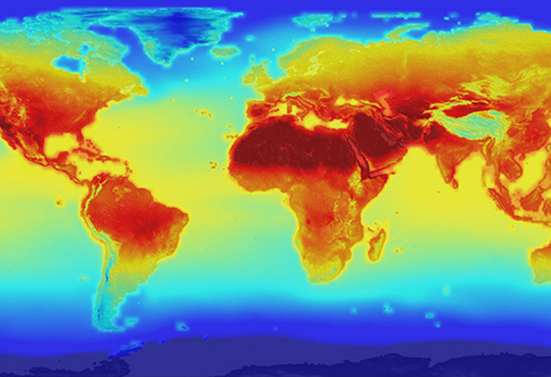

Il clima non può essere considerato come qualcosa di statico e invariabile, infatti può cambiare nel tempo anche in modo molto evidente, basti pensare all’alternanza fra periodi glaciali e interglaciali che si sono avuti sulla Terra negli ultimi tre milioni di anni, causati da piccole variazioni dell’orbita terrestre.

L’ultima glaciazione si è conclusa circa 12.000 anni fa e ci troviamo attualmente in una fase interglaciale che va sotto il nome di Olocene \(dal greco “del tutto recente”\). L’inizio di questa era geologica coincide con lo sviluppo delle prime civiltà.

Venendo a tempi molto più recenti, non vi è dubbio alcuno che la temperatura della Terra sia aumentata notevolmente negli ultimi 150 anni, come mostrato in figura 1 alla pagina precedente. Questo aumento è particolarmente pronunciato a partire dall’inizio del XX secolo e ha subito un’ulteriore accelerazione a partire dal secondo dopoguerra.

Le emissioni di gas serra dall’inizio della rivoluzione industriale hanno portato a un aumento esponenziale della loro concentrazione in atmosfera. Fra il 1750 e il 2011 le emissioni antropiche del solo CO2 sono state di circa 2.000 Gt \(miliardi di tonnellate\). Di queste circa il 45% è rimasto in atmosfera \(circa 900 Gt\), mentre il restante è stato rimosso dall’atmosfera e immagazzinato, in parti pressoché uguali, nella vegetazione e nell’oceano. Ciò che è ancora più importante, la metà delle emissioni cumulative di CO2 dall’inizio della rivoluzione industriale a oggi ha avuto luogo negli ultimi quaranta anni. Questo ci fa intuitivamente capire come l’accelerazione dell’aumento delle emissioni nelle ultime decadi costituisca il principale agente responsabile del riscaldamento climatico del pianeta. Con questa velocità di crescita delle emissioni, l’oceano e la vegetazione non sono in grado di rimuovere il biossido di carbonio come avveniva nei passati secoli e millenni, e questo ha determinato l’enorme crescita della sua concentrazione in atmosfera dando luogo al cosiddetto effetto serra antropico.

Tutte le attività umane comportano infatti l’emissione di gas serra e la figura 2 mostra il contributo dei vari settori economici alle emissioni globali, che nel 2010 hanno raggiunto 49 GtCO2eq per anno \(miliardi di tonnellate di CO2 equivalenti all’anno, la somma di tutti i gas serra espressi come CO2\).

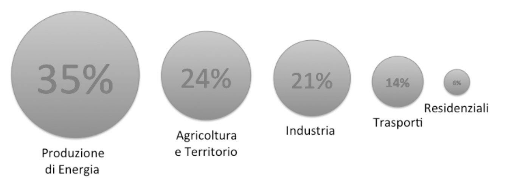

### **Gli effetti del riscaldamento del clima della Terra**

Gli effetti del riscaldamento del clima si possono riassumere schematicamente in funzione dei principali parametri climatici. Gli effetti riportati sono chiaramente valutati globalmente e possono differire, anche in misura sostanziale, a seconda delle diverse aree del pianeta.

* L’aumento della temperatura sta già influenzando negativamente le rese in agricoltura ponendo in serio pericolo la disponibilità di risorse alimentari. Allo stesso modo, l’aumento della temperatura dell’oceano sta influendo sulla biodiversità marina influenzando, fra l’altro, le risorse ittiche. In un mondo più caldo aumentano inoltre le probabilità di incendi forestali. Infine, l’aumento della temperatura influenza anche la salute umana, si pensi ad esempio al numero anomalo di decessi causati in Europa dall’ondata di calore dell’estate 2003. Il riscaldamento climatico sta inoltre portando a un’alterazione del regime delle precipitazioni con effetti sulla disponibilità di risorse idriche e, ovviamente, sulla produzione agricola. 
* L’innalzamento del livello del mare mette in pericolo le zone costiere di tutto il globo causando la sommersione di ampie aree, inondazioni e potenziali ondate migratorie dalle zone a rischio. Si calcola che un innalzamento di un metro del livello dei mari porterebbe a dovere ricollocare circa 190 milioni di persone su scala globale.
* Il progressivo scioglimento dei ghiacci sta mettendo in pericolo la disponibilità di acqua dolce, le cui riserve già stanno diminuendo. In conseguenza di ciò è purtroppo da mettere in conto anche il rischio di nuove guerre per l’accesso alle risorse idriche.
* Lo scioglimento dei ghiacci contribuisce chiaramente anche all’innalzamento del livello del mare.
* Vi sono infine gli eventi estremi. Nella maggior parte del globo è cresciuta la frequenza delle ondate di calore. Mentre è cresciuta la frequenza di precipitazioni intense in determinate aree del globo, è anche aumentata l’estensione delle zone aride del pianeta. È inoltre aumentata la frequenza dei cicloni tropicali. 

### **Il Comitato Intergovernativo sui Cambiamenti Climatici e l’Accordo di Parigi**

Il Comitato Intergovernativo sui Cambiamenti Climatici \(Intergovernmental Panel on Climate change, IPCC\) è stato istituito nel 1988 dall’Organizzazione Meteorologica Mondiale \(WMO\) e dal Programma Ambientale delle Nazioni Unite \(UNEP\) con il compito di fornire a tutti i governi periodici aggiornamenti sullo stato delle conoscenze riguardo i cambiamenti climatici associati alle attività antropiche, il loro impatto e le opzioni per l’adattamento e la mitigazione. Le politiche ambientali elaborate dai governi sui cambiamenti climatici utilizzano le basi scientifiche dei rapporti IPCC. Le azioni concrete per il contrasto al cambiamento climatico sono, infatti, compito della politica e dei governi e i rapporti IPCC sono formulati secondo il principio policy relevant but not policy prescriptive, rilevanti per le politiche ma non prescrittivi. È bene infatti ricordare che IPCC è composto da scienziati che si prestano volontariamente per sintetizzare la corposa letteratura scientifica del settore. Le politiche ambientali dei vari Paesi costituiscono poi la base per le negoziazioni nella Convenzione Quadro delle Nazioni Unite sui Cambiamenti Climatici \(UNFCCC\).

Nel 2013-2014 IPCC ha pubblicato il suo quinto rapporto.,

Dalle oltre 6.000 pagine del rapporto, basato sull’analisi di oltre 30.000 pubblicazioni scientifiche, emergono due conclusioni chiave:

1. il riscaldamento del clima della Terra è inequivocabile;
2. è evidente l’influenza delle attività umane sul sistema climatico e le attività umane sono la causa dominante del riscaldamento osservato dalla metà del XX secolo.

Per più di venti anni i governi di tutto il mondo hanno dibattuto per trovare un accordo internazionale che potesse limitare gli effetti sull’ambiente e sulla società del riscaldamento del clima. I principali punti di disaccordo riguardavano criteri di equità fra i Paesi. Occorre infatti ricordare che i Paesi industrializzati sono responsabili di più del 50% delle emissioni di gas serra dall’inizio dell’era industriale a oggi e solo negli ultimi decenni le economie emergenti hanno iniziato a contribuire sostanzialmente alle emissioni globali di gas serra, con la Cina divenuta solo 6 anni fa il principale responsabile delle emissioni di gas serra \(ca. 25% del totale mondiale\), sorpassando gli Stati Uniti che erano stati fino ad allora i primi in questa non invidiabile graduatoria.

Finalmente, sotto la spinta dei risultati del 5° Rapporto IPCC, il 12 dicembre 2015, nell’ambito della XXI Sessione della UNFCCC, 196 Paesi, responsabili del 95% delle emissioni globali di gas serra, hanno approvato il documento finale denominato “Accordo di Parigi” che ha finalmente gettato le basi per un coordinamento delle politiche internazionali di contrasto al riscaldamento climatico.

Gli obiettivi principali dell’Accordo di Parigi sono:

1. mantenere l’aumento della temperatura media globale ben al di sotto di 2 °C rispetto ai livelli preindustriali, e proseguire l’azione volta a limitare l’aumento di temperatura a 1,5 °C, riconoscendo che ciò potrebbe ridurre in modo significativo i rischi e gli effetti dei cambiamenti climatici;
2. aumentare la capacità di adattamento agli effetti negativi dei cambiamenti climatici e promuovere lo sviluppo resiliente al clima e a basse emissioni di gas ad effetto serra, di modo che non minacci la produzione alimentare;
3. rendere i flussi finanziari coerenti con un percorso che conduca a uno sviluppo a basse emissioni di gas ad effetto serra e resiliente al clima.

Al di là di alcune critiche, anche giustificate, sui limiti di questo accordo, non si può non valutare positivamente il consenso raggiunto, dopo un ventennio di tentativi falliti, dai governi di tutto il mondo su un problema che riguarda non solo tutti noi, ma anche le generazioni future.

### **Il Rapporto IPCC Global Warming of 1,5 °C**

Fra le iniziative in ambito ONU per l’applicazione dell’Accordo di Parigi, l’UNFCCC ha commissionato nel 2016 a IPCC la preparazione di un Rapporto speciale che potesse rendere conto degli impatti di un riscaldamento globale di 1,5 °C rispetto al periodo preindustriale. Questo Rapporto è stato finalizzato il 5 ottobre 2018. In estrema sintesi i risultati del Rapporto possono essere riassunti in alcuni punti principali.

1. Le attività umane hanno causato a oggi un riscaldamento della temperatura media globale di circa 1,0 °C rispetto ai livelli preindustriali.
2. Il riscaldamento globale di origine antropica sta crescendo a un tasso di 0,2 °C per decennio e, se nulla verrà fatto, l’aumento di 1,5° rispetto al periodo preindustriale verrà raggiunto fra il 2030 e il 2050.
3. Gli impatti del riscaldamento climatico previsti limitando l’aumento della temperatura media globale a 1,5 °C rispetto alla situazione di aumento di 2 °C sono sensibili sia in termini economici che sociali come riportato dalla Fig. 3.

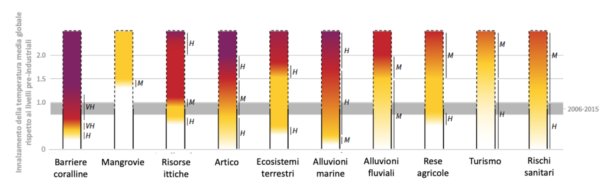

Al fine di limitare il riscaldamento globale a 1,5 °C, le emissioni di CO2 dovranno ridursi globalmente del 45% nel 2030 rispetto ai valori del 2010 \(20% nel caso di 2 °C\), e raggiungere il livello 0 nel 2050 \(2075 nel caso di 2 °C\). È anche necessaria una contemporanea limitazione delle emissioni di specie climalteranti diverse da CO2.

Nella figura 4 sono riportati quattro scenari di andamento delle emissioni di CO2a seconda degli obiettivi che la comunità internazionale vorrà e saprà darsi.

Senza entrare troppo nei dettagli della figura, si può comunque facilmente notare come tutti gli scenari di mitigazione previsti prevedano il raggiungimento di emissioni zero a metà del corrente secolo, dopo di che le emissioni diventano negative. Questo significa che, per rimanere entro i parametri che prevedono la limitazione dell’aumento della temperatura alla fine del secolo a meno di 1,5 °C, una parte della CO2 già emessa nel corso dei due secoli precedenti da parte delle attività umane dovrà essere rimossa dall’atmosfera.

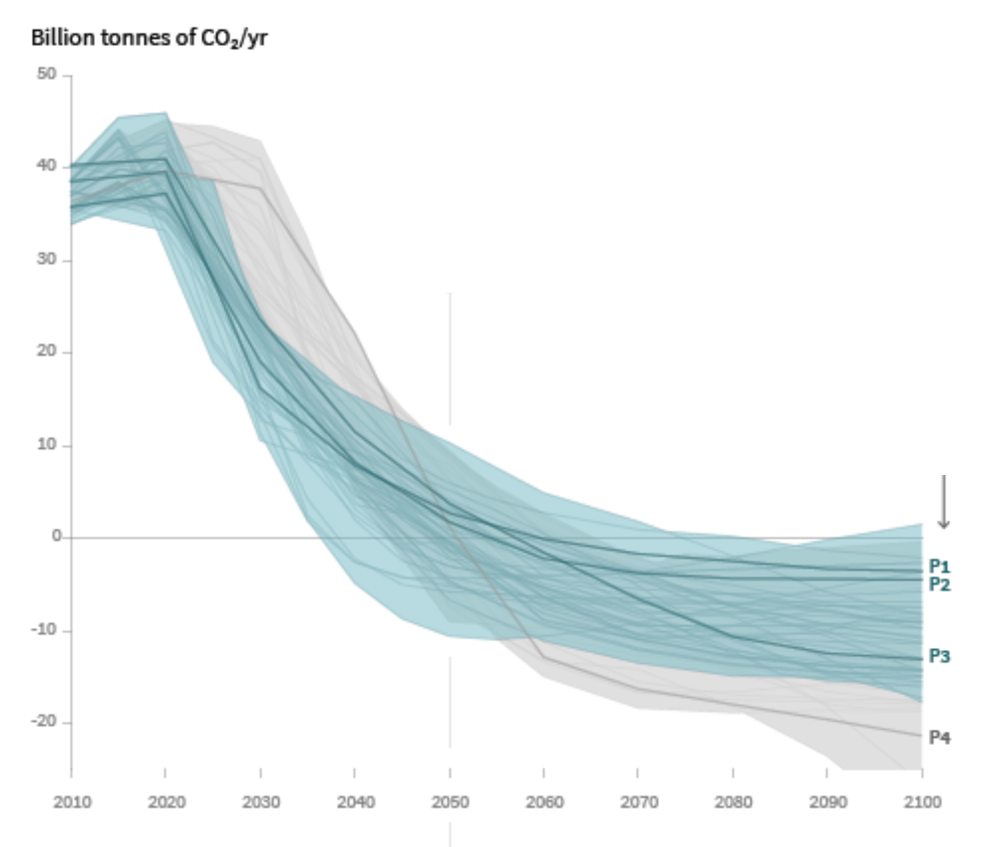

Le tecnologie per la rimozione dall’atmosfera della CO2 atmosferica sono ancora a un livello prototipale e non sono ancora mai state sperimentate su larga scala. Vi è tempo fino a metà del secolo per rafforzare queste tecnologie che possano aiutare il raggiungimento dell’obiettivo.

Sono certamente necessari ulteriori investimenti per contrastare il riscaldamento del clima della Terra, che vengono stimati in circa 450 miliardi di dollari l’anno fino al 2030 per il raggiungimento dell’obiettivo 1,5 °C, comparati ai circa 300 miliardi necessari per raggiungere l’obiettivo di 2 °C. A fronte di questi costi, occorre comunque ricordare che tutte le valutazioni economiche e sociali riportano costi molto più elevati per l’eventuale necessità di adattamento al cambiamento climatico in assenza delle adeguate politiche di mitigazione.

A questo proposito, il Rapporto 1,5 °C rileva come il cambiamento climatico agisca come moltiplicatore dei problemi ambientali esistenti e che adeguate politiche di mitigazione sono senz’altro sinergiche con gli Obiettivi di Sviluppo Sostenibile \(SDG\) varati dalle Nazioni Unite \(contrasto alla povertà, contrasto alla fame, protezione della salute, parità di genere, ecc.\).

### **Il negazionismo climatico**

Gli scienziati del clima, ben rappresentati da IPCC, concordano largamente sul cambiamento climatico in atto e sulle sue origini principalmente di natura antropica \(da una rassegna della letteratura scientifica, il consenso risulta del 97%\), ma anche sul fatto che dobbiamo contrastare rapidamente i pericoli di un pianeta che si riscalda.

In Europa l’accettazione del principio per cui il cambiamento climatico rappresenta un pericolo reale per la nostra società e che il contributo delle attività antropiche ne è la causa principale è ormai diffusa. Non mancano però, talvolta anche all’interno della comunità scientifica, posizioni cosiddette “negazioniste” sull’origine antropica del cambiamento climatico. L’aspetto importante da sottolineare è che fra i sostenitori di queste posizioni vi sono per lo più soggetti privi di competenze specifiche sul tema. Anche a livello dei mezzi di comunicazione, si assiste purtroppo anche nel nostro Paese a un susseguirsi di informazioni spurie, più che altro all’insegna del sensazionalismo, in un verso e nell’altro, che lasciano senz’altro il pubblico piuttosto interdetto. Chiunque, utilizzando magari livelli di notorietà acquisiti in altri settori, si sente in dovere di discettare sul clima che cambia trovando sempre compiacenti microfoni e taccuini pronti a riportare le più disparate opinioni.

Interessanti studi sociologici sul negazionismo climatico sono purtroppo disponibili quasi unicamente per quanto riguarda la realtà statunitense. Questi studi evidenziano come lo scetticismo riguardo al cambiamento climatico e alle sue cause antropiche non sia funzione del censo e del livello di scolarizzazione, come ci si potrebbe aspettare, ma principalmente dell’ideologia e delle posizioni politiche. È quindi evidente come anche la buona scienza possa ben poco contro posizioni ideologiche e preconcette.

## Cambiamenti globali ed ecosistemi naturali

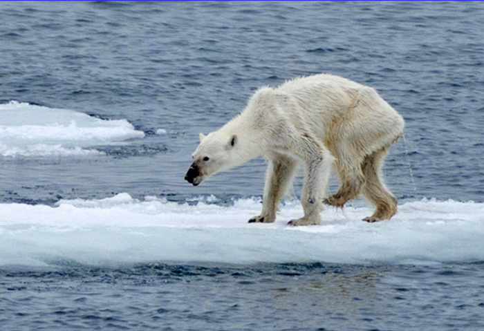

Negli ultimi 50 anni gli uomini hanno cambiato gli ecosistemi più rapidamente e in modo più intenso di qualunque altro periodo della storia umana. Ciò ha determinato una perdita sostanziale e irreversibile di molte funzioni degli ecosistemi del nostro Pianeta. Più terra è stata convertita in agricoltura dal 1945 di quanto non sia avvenuto nel XVIII e XIX secolo, a spese del capitale naturale del Pianeta.

Nonostante ciò, dal 1960 ad oggi abbiamo ridotto la quantità di terra agricola pro capite da 0,7 a 0,4 ettari, con una velocità di deforestazione pari a circa 13 milioni di ettari \(ha\) per anno \(la superficie forestale italiana ammonta a circa 10 milioni di ettari\) a dimostrazione di come non riusciamo a tenere testa all’incremento demografico e ai cambiamenti di stile alimentare. Dal 1960 si è quadruplicata la raccolta dell’acqua nei bacini idrici e se ne è raddoppiato il consumo.

La trasformazione antropica degli ecosistemi naturali ha ridotto la loro capacità di fornire servizi importanti per la nostra vita. Oltre ai servizi più facili da immaginare come la produzione di materie prime, importanti funzioni di regolazione sono oggi a rischio. A fronte dei 32 miliardi di tonnellate di anidride carbonica emesse dai combustibili fossili e dei 9 miliardi emesse dalla deforestazione tropicale, solo il 46% rimane in atmosfera, mentre il 28% delle emissioni sono riassorbite dagli ecosistemi terrestri \(in particolare foreste\) e il 26% dagli oceani.

Quindi le foreste e gli oceani svolgono un servizio importante nel diminuire l’impatto delle emissioni dei combustibili fossili sul sistema climatico. Senza questo contributo ci ritroveremo con un Pianeta ancora più caldo di quello che abbiamo oggi. Analogamente altri servizi di supporto alla nostra vita come la biodiversità, la fertilità dei suoli, la protezione idrogeologica, la qualità dell’aria, ma anche funzioni estetiche e spirituali come il paesaggio e l’uso sociale degli alberi in molte comunità umane sono servizi assicurati dagli ecosistemi. Per questo motivo la loro integrità è fondamentale per continuare a svolgere queste funzioni per le prossime generazioni.

Tuttavia, i cambiamenti climatici e le attività umane di sfruttamento delle risorse naturali stanno modificando e riducendo sensibilmente queste funzioni con il risultato di aggravare gli impatti sulla nostra vita. Negli ultimi anni la mortalità degli alberi è diventata un fenomeno diffuso in molti continenti, passando da un fenomeno naturale a un vero e proprio allarme di emergenza ambientale e il rapporto AR5 dell’IPCC \(AR5, IPCC\) hanno mostrato come sia diffuso in molti continenti e regioni \(tra cui l’area mediterranea\) il deperimento di alberi e porzioni importati di foresta. Spesso questi fenomeni sono associati a estremi anomali di temperature o siccità intense ed estese per più giorni sia in foreste temperate e boreali, che tropicali.

Un altro elemento di preoccupazione è la velocità con cui si sta manifestando il cambiamento climatico. Per molti organismi viventi la velocità di adattamento non è sufficiente a contrastare il cambiamento climatico se questo è molto veloce. Ad esempio, per le piante anche solo una variazione di 0,01 °C per anno non è sostenibile, visto che non possono facilmente spostarsi e cambiare habitat.

Gli animali sono più veloci nell’adattarsi ma entro certi limiti. Ad esempio molti mammiferi carnivori \(tra i più capaci di adattamento\) soccombono a fronte di un aumento di temperatura di circa 0,06 °C per anno \(figura 5\).

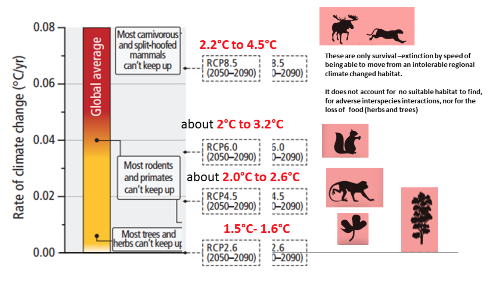

Gli scenari futuri che abbiamo davanti si complicano molto per la molteplicità e la complessità dei feedback del nostro Pianeta. Ecco alcuni elementi di riflessione:

1. La pressione antropica sugli ecosistemi naturali negli ultimi 50 anni è aumentata a un ritmo eccezionale, mai sperimentata in tutta la storia del genere umano, che aggrava quanto già il cambiamento climatico sta facendo, riducendo i principali servizi ecosistemici del nostro capitale naturale e accelerando quindi la crisi sistemica globale.
2. L’impatto dei cambiamenti climatici sulle funzioni di regolazione degli ecosistemi può generare dei feedback positivi \(amplificazione\) che possono aggravare ancora di più il livello di concentrazione dei gas serra nell’atmosfera, intensificando il riscaldamento globale. Ad esempio la mortalità degli alberi, sottraendo la capacità di fissazione del biossido di carbonio dall’atmosfera, oppure lo sfruttamento dei suoli boreali e gli incendi delle foreste tropicali, possono innescare un aumento dei livelli di gas serra nell’atmosfera, in aggiunta a quanto già contribuiscono i combustibili fossili.
3. La velocità del riscaldamento globale può essere un fattore decisivo nei processi di estinzione di molte specie vegetali e animali che non riescono ad adattarsi velocemente.
4. La pressione antropica sulle risorse naturali non si può risolvere solo con l’aumento dei sistemi di produzione \(es. agricoltura intensiva\), ma attraverso un’azione equilibrata di riduzione dei processi di consumo che hanno raggiunto livelli insostenibili per il Pianeta, includendo la necessità di riduzione degli sprechi e il riuso dei materiali.

## Cambiamenti globali, risorse alimentari e idriche

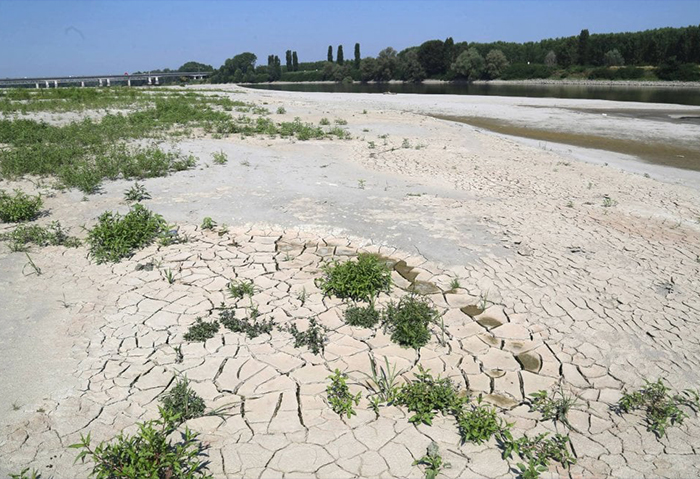

I cambiamenti globali \(eventi estremi, ondate di calore, inondazioni, siccità\) hanno importanti implicazioni per il settore agricolo e dell’allevamento, mettendo a rischio la sicurezza alimentare del mondo intero. Grano, riso, mais e soia costituiscono i due terzi del consumo calorico umano a livello globale. È previsto che per ogni grado di aumento della temperatura media globale le rese agricole per queste colture diminuiscano del 6%, 3%, 7%, 3% rispettivamente, mentre la domanda per questi prodotti crescerà del 14% ogni decennio fino a metà del secolo corrente. Anche altri tipi di coltivazione quali caffè, cacao, the subiranno inevitabilmente riduzioni della produzione dovute ai vari aspetti del cambiamento globale.

Questi rischi per il comparto agricolo saranno particolarmente acuti nei Paesi in via di sviluppo a causa della mancanza in queste aree di adeguate conoscenze e tecnologie.

In molte regioni del globo i cambiamenti del regime delle precipitazioni e il ritirarsi dei ghiacciai stanno alterando le risorse idriche di acqua dolce costituendo un ulteriore impatto sull’agricoltura e l’allevamento che utilizzano circa il 70% delle risorse idriche a livello globale.

Anche la qualità di alcuni alimenti è destinata a deteriorarsi a causa dei cambiamenti globali. Grano, riso, orzo e patate cresciute in un ambiente con concentrazioni sempre crescenti di CO2 vedranno diminuire il loro contenuto di proteine di circa il 10%, mentre altri prodotti subiranno una riduzione del contenuto di minerali e micronutrienti.

I cambiamenti climatici, inoltre, stanno producendo uno spostamento di organismi patogeni in aree in precedenza non interessate, causando effetti negativi sia sulle coltivazioni che sugli allevamenti.

Va anche detto che agricoltura e allevamento contribuiscono in maniera rilevante al cambiamento globale dell’ambiente. Oltre all’enorme consumo di acqua che il comparto richiede, la produzione di carne, particolarmente quella dei ruminanti, fornisce un notevole contributo al riscaldamento del clima a causa del metano emesso da queste specie animali. Tecnologie agricole più rispettose dell’ambiente e con un minore consumo idrico e una drastica riduzione del consumo di carne rossa a livello globale possono concorrere sostanzialmente a mitigare i cambiamenti globali.

Anche le risorse ittiche sono minacciate dal cambiamento globale. A causa del riscaldamento degli oceani, la loro produttività è destinata a diminuire riducendo allo stesso tempo le aree di pesca e le loro rese in termini di pescato, mettendo a rischio le risorse alimentari di circa 400 milioni di persone la cui dieta è essenzialmente costituita da pesce. Alcune specie ittiche che non hanno sufficiente capacità di adattamento sono destinate a scomparire riducendo ulteriormente la biodiversità del pianeta.

## Cambiamenti globali e salute umana

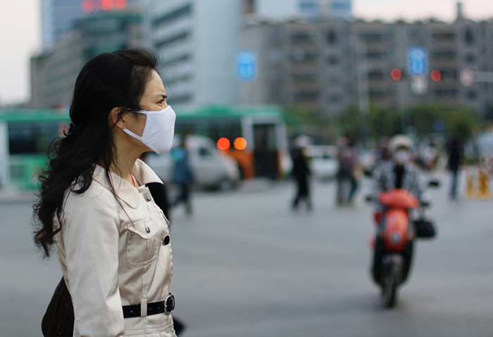

Il Rapporto sulla qualità dell’aria a livello globale preparato recentemente dall’Health Effects Institute offre un quadro completo dei rischi per la salute connessi con l’inquinamento atmosferico globale e con la qualità dell’aria negli ambienti domestici.

La presenza in atmosfera del particolato atmosferico fine \(PM2,5, colloquialmente definito polveri sottili\) costituisce il sesto fattore di rischio per la salute umana \(dopo l’ipertensione, il fumo, l’iperglicemia, l’obesità, il colesterolo alto\) e ha causato nel 2016 a livello globale 4,1 milioni di morti per disturbi respiratori, cardiovascolari e per cancro polmonare, un numero molto maggiore di decessi rispetto a più noti fattori di rischio quali l’abuso di alcol o l’inattività fisica e simile a quello dei decessi dovuti a elevati livelli di colesterolo nel sangue o all’obesità.

Il secondo principale inquinante atmosferico che causa effetti negativi sulla salute è l’ozono \(O3\), un gas i cui livelli di concentrazione sono in aumento su tutto il globo, e che è stato responsabile nel 2016 di 234.000 decessi.

L’Organizzazione Mondiale della Sanità \(OMS\) ha stabilito, sulla base di varie ricerche epidemiologiche, un limite di concentrazione di PM2,5 per la tutela della salute umana di 10 μg/m3 di media annua, con la consapevolezza però che non possono essere totalmente esclusi effetti nocivi anche a concentrazioni inferiori a questo livello. Il 95% della popolazione mondiale vive in zone nelle quali il limite stabilito dall’OMS non è rispettato. La figura 6 riporta la distribuzione di vari livelli di concentrazione di PM2,5 a livello globale.

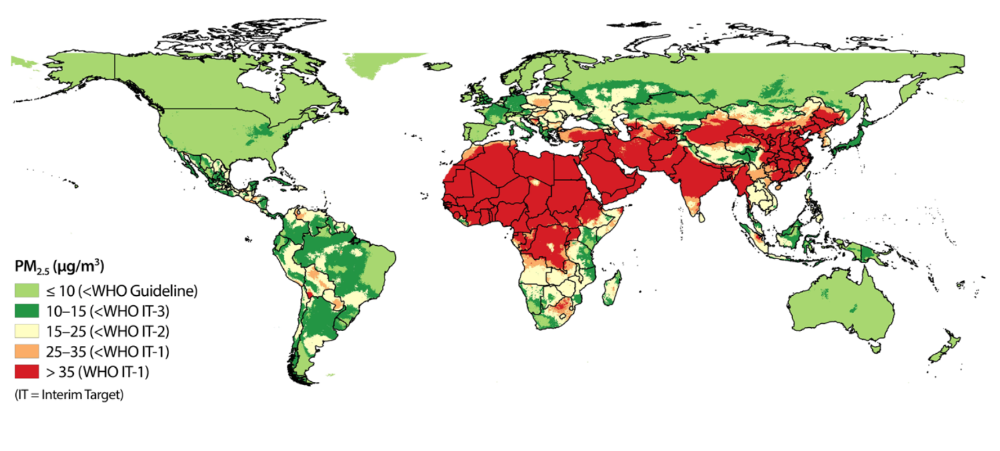

I livelli di concentrazione di O3 \(valore limite OMS 100 μg/m3 di media giornaliera\) sono molto meno variabili rispetto a quelli di PM2,5, ma sono relativamente elevati negli USA, nell’Africa sub-Sahariana, nell’area del Mediterraneo, nel Medio Oriente, e nell’intero continente asiatico.3

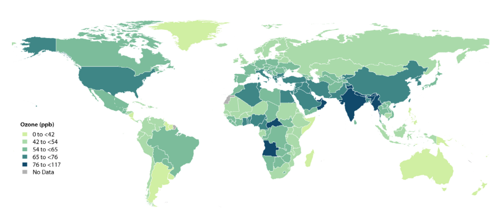

### **Inquinamento degli ambienti domestici**

Circa 3,5 milioni di decessi annui sono dovuti all’esposizione all’inquinamento negli ambienti domestici. Si tratta in questo caso di un fenomeno principalmente ristretto ai continenti asiatico e africano ed è dovuto principalmente all’utilizzo, per il riscaldamento e per la preparazione dei pasti, di combustibili di bassa qualità in stufe altamente inefficienti e in ambienti non adeguatamente ventilati. In ambienti domestici di questo tipo le concentrazioni di PM2,5 possono raggiungere concentrazioni di 20 volte il limite fissato dall’OMS per l’aria ambiente. Questo tipo di particolato contiene a sua volta un’elevata percentuale di black carbon, un componente derivato dalla combustione inefficiente ed estremamente dannoso per la salute.

## Energia per l’astronave Terra

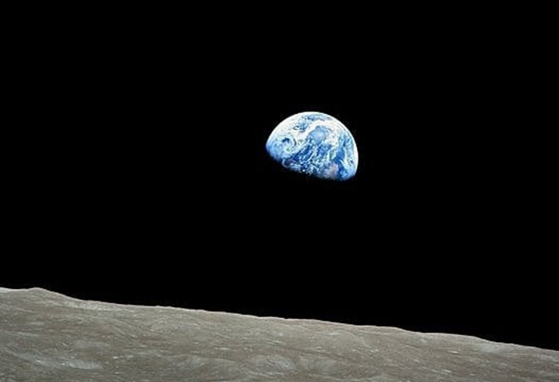

Il pianeta Terra è una specie di astronave che viaggia nell’infinità dell’Universo. È un’astronave del tutto speciale perché non potrà mai “atterrare” in nessun luogo per fare rifornimento, per essere riparata o per sbarazzarsi dei rifiuti che vi si accumulano. L’unico rapporto con l’esterno è l’energia che riceve dal Sole, risorsa fondamentale per la vita dei 7,3 miliardi di passeggeri. L’astronave Terra ha dimensioni limitate. Pertanto, le risorse di cui disponiamo sono finite e limitato è anche lo spazio in cui collocare i rifiuti. Una realtà che, a volte, economisti e politici sembrano non conoscere.

Dopo aver goduto a lungo dell’energia dei combustibili fossili, oggi sappiamo che il “rifiuto” generato dalla loro combustione \(biossido di carbonio, CO2\) è il principale responsabile del cambiamento climatico. Se vogliamo salvare il pianeta, la nostra casa comune, dobbiamo smettere di usare i combustibili fossili. L’Accordo di Parigi ha segnato una svolta storica di cui, forse, non tutti hanno ancora capito l’importanza: l’Antropocene, l’Era dell’Uomo, caratterizzata da un intenso uso dei combustibili fossili, ci ha indotto ad accettare la progressiva, inevitabile rinuncia a questa fonte energetica.

### **I combustibili fossili**

Nel 2017 su scala mondiale abbiamo immesso nell’atmosfera 32 miliardi di tonnellate di CO2, che abbiamo generato bruciando, ogni secondo, 1.140 barili di petrolio, 105.000 metri cubi di gas e 250 tonnellate di carbone. A questo ritmo, le riserve accertate di petrolio sono sufficienti per 50 anni, quelle di gas per 52 anni e quelle di carbone per 134 anni. È stato calcolato però che per avere almeno il 50% di probabilità che l’aumento della temperatura del pianeta non superi i 2 °C, come richiesto dall’Accordo di Parigi, devono rimanere inutilizzate il 30% delle riserve di petrolio, il 50% di quelle di gas e l’80% di quelle di carbone. Ciononostante, le compagnie petrolifere continuano a ricercare altro petrolio e gas. Esse, infatti, sperano che l’accordo di Parigi non sarà rispettato; anzi, con la loro grande potenza economica e politica operano in questo senso. Sono costrette a riconoscere che la transizione energetica dai combustibili fossili alle energie rinnovabili, già avviata, è ineluttabile, ma cercano almeno di rallentarla. Sostengono che le energie rinnovabili sono immature, costose e inaffidabili perché intermittenti e che quindi il loro sviluppo dovrà essere accompagnato dall’uso, come energia ponte, del più “innocente” dei combustibili fossili, il gas \(metano\).

A parità di energia prodotta, la quantità di CO2 generata dal metano è inferiore di circa il 66% rispetto al carbone e il 24% rispetto al petrolio; ma questo non basta per raggiungere l’obiettivo di Parigi. Per di più, il metano è un gas serra 72 volte più potente di CO2 e si stima che nella lunga filiera del gas ci siano perdite di almeno il 3% rispetto alla quantità usata. Quindi passando al gas non si combatte affatto il cambiamento climatico. Inoltre, studi recenti mostrano che l’uso del gas non è vantaggioso neppure per la salute dell’uomo perché, rispetto ai motori alimentati con gasolio, quelli alimentati con metano producono particelle in numero superiore e più piccole, quindi potenzialmente più pericolose per la salute.

### **Le energie rinnovabili**

Le energie rinnovabili \(biomassa, idroelettrica, eolica, solare, geotermica\) hanno oggi una potenza pari a 2.195 GW e forniscono circa il 10% dell’energia primaria e il 26,5% dell’energia elettrica. Per raggiungere l’obiettivo dell’Accordo di Parigi dovranno svilupparsi fino a coprire il 100% dell’energia elettrica entro il 2035-2040 e il 100% dell’energia primaria entro il 2050. Questo è possibile se si punta su energie rinnovabili in fase di rapido sviluppo, ben collaudate, poco costose e con basso impatto ambientale, come sono oggi l’energia eolica e l’energia fotovoltaica.

Gli impianti eolici possono essere installati sul suolo o in mare. La potenza eolica a fine 2017 ha raggiunto 539 GW \(+9,6% rispetto al 2016\), che hanno generato una quantità di energia paragonabile a quella di circa 180 reattori nucleari da 1.000 MW. Dalle pale eoliche con turbine di 15 m di diametro e 50 kW di potenza, si è passati a turbine con 140 m di diametro e 8,8 MW di potenza: una sola rotazione della turbina fornisce l’energia necessaria ad una abitazione per un giorno. Ogni volta che la capacità eolica globale raddoppia, il costo dell’elettricità che produce diminuisce del 15%.

Per quanto riguarda il fotovoltaico il suo grande vantaggio consiste nel poter generare energia elettrica in qualsiasi luogo illuminato dal Sole, consentendo l’accesso all’elettricità anche nei posti più isolati. Nel 2017 il fotovoltaico ha raggiunto 402 GW \(+ 24% rispetto al 2016\) e ha generato una quantità di energia paragonabile a quella ottenibile da 80 reattori nucleari da 1.000 MW. L’85% del fotovoltaico installato nel mondo usa pannelli rigidi nei quali il materiale fotoattivo è una sottilissima lamina di silicio; hanno efficienza di circa il 18-20% \(per confronto, la fotosintesi naturale ha efficienza &lt;0,5%\) e durata di almeno 25-30 anni. In futuro verranno sostituiti con moduli flessibili di uso più generale e con celle a giunzione multipla \(46% di efficienza in laboratorio\).

Gli impianti eolici e fotovoltaici producono energia fino a 20 volte quella investita per costruirli, non hanno bisogno di acqua per il raffreddamento, richiedono una manutenzione minima e in fase di dismissione possono essere riciclati quasi integralmente. Gli impianti eolici comportano un uso ridotto del territorio perché l’agricoltura continua normalmente nei terreni su cui vengono installati. Gli impianti fotovoltaici possono essere collocati sui tetti di abitazioni, industrie, parcheggi e altre strutture già esistenti.

Eolico e fotovoltaico sono energie intermittenti; per ottimizzare le loro prestazioni è, quindi, necessario utilizzare sistemi di accumulo come batterie, pompaggio idroelettrico e anche produzione di idrogeno elettrolitico, che può essere riconvertito in energia elettrica mediante celle a combustibile. Il progresso nella generazione di energia elettrica con fotovoltaico ed eolico ha favorito lo sviluppo delle batterie, il cui prezzo è sceso dell’85% negli ultimi otto anni, dando inizio a quella che i tecnici chiamano clean disruption nel settore dei trasporti. Le previsioni indicano che nel 2025 saranno prodotte circa 30 milioni di auto elettriche. In molti Paesi, intanto, il prezzo dell’elettricità generata da eolico e fotovoltaico, compreso l’accumulo, è minore del prezzo dell’elettricità prodotta dai combustibili fossili, anche senza conteggiare i benefici economici legati ai danni evitati alla salute pubblica e all’ambiente.

### **La rivoluzione energetica**

La transizione energetica dai combustibili fossili alle energie rinnovabili comporta grandi cambiamenti nel modo di produrre, trasportare e utilizzare energia. I combustibili fossili generano energia termica che si può usare direttamente, oppure convertire, ma con bassa efficienza, in energia elettrica o meccanica. Le energie rinnovabili generano energia elettrica, che può essere usata come tale oppure può essere convertita con alta efficienza in calore e in energia meccanica. Quindi, l’economia basata sulle fonti rinnovabili ha un’efficienza energetica molto maggiore dell’economia basata sui combustibili fossili.

Le energie rinnovabili hanno anche altri vantaggi rispetto a quelle fossili. I combustibili fossili si trovano allo stato grezzo sotto la crosta terrestre, solo in alcune regioni del mondo; quindi devono essere estratti, raffinati e trasportati nei luoghi d’uso. Tutte queste operazioni sono pericolose e spesso oggetto di incidenti, da quello della Deepwater Horizon costato alla BP 61,6 miliardi di dollari, a quello molto più piccolo, ma significativo, del 6 agosto 2018 in autostrada a Bologna. Le fonti rinnovabili \(luce, vento, acqua\) piovono dal cielo: l’elettricità che producono si deve solo raccogliere e può essere trasmessa e distribuita tramite fili, senza problemi.

### **La transizione energetica**

La transizione energetica dai combustibili fossili alle energie rinnovabili è estremamente complessa dal punto di vista tecnico, economico, politico e anche psicologico. Si tratta infatti di passare dall’uso di fonti energetiche concentrate, presenti in pochi Paesi, pericolose, inquinanti, causa di controversie economiche e commerciali, esposte ad attentati e particolarmente adatte ad alimentare le guerre, a fonti energetiche diluite, diffuse su tutta la Terra, non pericolose, non inquinanti, che non possono essere usate per la guerra e neppure essere oggetto di attentati.

La transizione energetica, quindi, implica una vera rivoluzione culturale in quanto riguarda il modo di vivere e di affrontare il futuro, interessa tutti i livelli organizzativi della società e ha profondi effetti economici e politici. È una grande sfida che può portarci a vivere in un mondo più giusto, più equo e più pacifico.

Papa Francesco ha sottolineato tutto questo nell’enciclica Laudato si’. Ha anche scritto che “vi sono motivazioni etiche profonde per incamminarci urgentemente verso una transizione energetica globale” e ha ricordato che “sono i poveri a soffrire maggiormente delle devastazioni del cambiamento climatico” e che “la transizione verso l’energia accessibile e pulita è una responsabilità che abbiamo verso milioni di nostri fratelli e sorelle nel mondo, verso i Paesi poveri e verso le generazioni che verranno”.

La transizione energetica fermerà il cambiamento climatico, eviterà la morte prematura di molte persone, aumenterà il numero di posti di lavoro e porterà benefici economici. Porterà vantaggi anche dal punto di vista sociale perché le nazioni più povere, quelle più colpite dai cambiamenti climatici, sono le più ricche di energie rinnovabili. La transizione non avverrà, però, spontaneamente; richiede, anzi, un forte impegno perché è ostacolata dalla lobby dei combustibili fossili, da speculazioni finanziarie e da controversie economiche e politiche. È opinione diffusa che l’obiettivo dell’Accordo di Parigi non sia raggiungibile senza una forte mobilitazione delle persone.

Bisogna anche rendersi conto che le tecnologie che fornisce la scienza per utilizzare le abbondanti energie rinnovabili trovano limiti nelle risorse del pianeta, cioè nella disponibilità dei materiali necessari per costruire le apparecchiature di conversione, di trasmissione e di accumulo: turbine eoliche, pannelli fotovoltaici, reti elettriche, batterie, ecc. Quindi, non potremo disporre di tutta l’energia che ci farebbe comodo avere e dovremo abituarci a non sprecarla.

### **Oltre la transizione energetica**

Per vivere in un mondo ecologicamente sostenibile, la transizione energetica deve essere accompagnata da un’altra transizione: quella dall’economia lineare dell’usa e getta all’economia circolare, basata su un impiego più limitato, più consapevole e più efficiente delle risorse, su una minore produzione di rifiuti e sul loro recupero per creare nuove risorse.

Tutto questo però non è ancora sufficiente perché, se vogliamo vivere in pace nella “casa comune”, l’Astronave Terra, è assolutamente necessario ridurre le disuguaglianze che affliggono l’umanità, sia su scala nazionale che globale. Dovremmo, come dice papa Francesco, “indignarci per le enormi disuguaglianze che esistono tra di noi; non ci accorgiamo più che alcuni si trascinano in una miseria degradante, mentre altri non sanno nemmeno che farsene di ciò che possiedono”. Per ridurre le disuguaglianze bisogna, quindi, compiere una terza transizione, integrata alle due precedenti: la transizione culturale dal consumismo alla sobrietà, che è la qualità essenziale di ogni relazione, con le risorse, con i rifiuti, con gli altri e con se stessi.

## Conclusioni

I problemi ambientali coinvolgono competenze e comunità scientifiche molto diversificate, come appare anche dalla provenienza disciplinare degli autori di questo contributo \(chimica, fisica, medicina\). Difficile quindi tracciare un quadro della ricerca italiana nel settore, se non per sottolineare che su molti di questi temi il nostro Paese esprime realtà di assoluto valore internazionale, ma anche il costante restringersi delle risorse umane, economiche e strumentali, fenomeno comune a tutta la ricerca italiana.

La ricerca nel settore ambientale, inoltre, ha bisogno di un approccio interdisciplinare. Le scienze dell’ambiente non costituiscono nel sistema Università-Ricerca italiano un ambito disciplinare, ma si avvalgono del contributo di fisica, chimica, biologia, geologia, agraria, ingegneria, ecc. Queste diverse comunità scientifiche non parlano tradizionalmente lo stesso linguaggio e usano approcci scientifici a volte completamente diversi. Un’ulteriore complicazione è che per un approccio scientifico efficace ai problemi ambientali occorre andare al di là della pura e semplice multidisciplinarietà, ma occorre raggiungere una vera sintesi interdisciplinare, ottenibile solamente se gli attori riescono a comunicare nello stesso linguaggio e a usare strumenti concettuali comuni. La sfida vale a maggior ragione per l’integrazione fra le scienze naturali e le scienze umane e sociali \(economia, sociologia, discipline giuridiche, ecc.\), data l’importanza del fattore umano nei cambiamenti ambientali.

Questo nuovo approccio interdisciplinare, che si va sempre più affermando nella ricerca ambientale internazionale, pone chiaramente problemi sia dal punto di vista della ricerca sia della formazione. Ovviamente problemi di questo genere esistono anche in altri Paesi; la differenza è però che in Italia tutto questo sembra essere molto più difficile da affrontare. Ciò è anche da collegarsi alla burocratizzazione della ricerca in Italia, a inadeguati meccanismi di reclutamento e selezione del personale e alla cristallizzazione del sistema Università-Ricerca nazionale attorno ai Settori scientifico-disciplinari.

