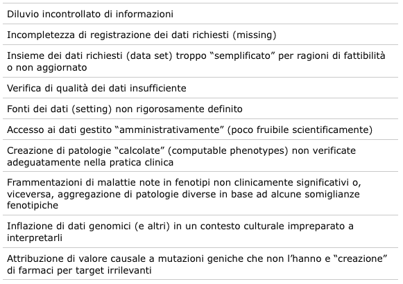
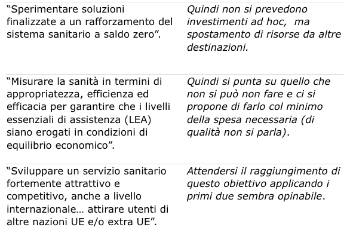

# La ricerca scientifica per un sistema sanitario intelligente

La qualità delle prestazioni mediche dipende da molti fattori organizzativi e scientifici. Dati recenti, raccolti soprattutto in ambito anglosassone, mostrano quali siano ancora oggi i limiti e la fallibilità della pratica clinica. Negli Stati Uniti errori diagnostici accadrebbero circa nel 15% di tutti gli incontri clinici, riguardando quindi 12 milioni di adulti ogni anno e determinando danni permanenti o morte in circa 160.000 pazienti ogni anno. Questi errori rappresenterebbero la terza causa di morte dopo le patologie cardiovascolari e il cancro1.

Un altro esempio che mette in evidenza come la pratica clinica possa essere difficile è il Care Homes Study2,3. Un gruppo di medici esperti, dotati di ecografo e della possibilità di eseguire esami ematochimici di routine si propose di verificare la correttezza della diagnosi di scompenso cardiaco nell’anziano, nel mondo reale. Vennero esaminati 405 residenti stabili \(età 65-100 anni\) di 33 case di riposo in UK. Nel 23% dei casi era stato diagnosticato precedentemente uno scompenso cardiaco e quindi gli ospiti erano trattati come tali. Nel 76% di costoro questa diagnosi non venne confermata; al contrario, dei casi diagnosticati come scompensati nella valutazione “sperimentale” il 90% non era stato diagnosticato in precedenza. Nessuno dei sintomi e segni clinici comuni nello scompenso cardiaco era emerso dall’analisi statistica come indicatore affidabile per la diagnosi.

Non c’è dubbio che la pratica clinica vada urgentemente migliorata, in parallelo con l’esponenzialmente crescente domanda di salute e benessere da parte dei cittadini. La ricerca clinica è lo strumento per farlo.

## La medicina basata sull’evidenza e i suoi limiti

L’inizio della ricerca clinica osservazionale empirica, applicata all'essere umano ammalato è difficilmente databile. Verosimilmente nasce con la storia delle comunità umane4. Solo nel secolo scorso, l’avanzare della tecnologia ha consentito una crescente capacità di vedere, quindi di misurare e analizzare invasivamente e non invasivamente il corpo umano, e di formalizzare i principi della metodologia della ricerca clinica.

Il primo passo è stato stabilire il concetto metodologico di prova clinica o “evidenza” \(dall’inglese _evidence_\), ovvero l’identificazione di strategie di ricerca che conducessero a conclusioni ritenute certe e generalizzabili, usabili consensualmente nella pratica clinica\). Il termine evidenza quindi, in medicina, ha una accezione specifica. In pratica significa “prova che consente l’uso clinico” che di solito implica un insieme di prove. Una delle definizioni convenzionali di evidenza recita: _Evidence refers to reliable, observational, inferential, or experimental information forming parts of the grounds for upholding or rejecting claims or beliefs_5.

Per lo più si tratta di studi controllati randomizzati nei quali, identificata una popolazione e un obiettivo di interesse, l’oggetto in studio \(un farmaco, una procedura terapeutica, una valutazione diagnostica, un percorso clinico ecc.\) si applica con scelta casuale \(_random_\) a metà della popolazione, e se ne riscontrano gli effetti paragonandola alla metà non trattata. Le differenze osservate tra i due gruppi costituiscono l’oggetto dello studio e, se statisticamente significative, rappresentano una evidenza. In realtà ogni persona ha un proprio, unico, genotipo e fenotipo e qualunque conoscenza generalizzabile ha dei limiti. Va intesa come utile o dannosa ai più, e tra costoro a chi più e a chi meno.

Per avere un’idea concreta dell’approssimazione della medicina basata sull’evidenza, basta considerare un indicatore di efficacia di un trattamento, il _Number Needed to Treat_ \(NNT\). L’NNT indica il numero di persone da trattare per un tempo dato per prevenire \(o ritardare\) un evento patologico, predefinito come obiettivo specifico \(_end-point_\) dello studio. Spesso è necessario trattare molte decine di pazienti per ottenere il risultato desiderato in uno. Anche per questa ragione nei trial è consueta l’analisi di sottogruppi di pazienti identificabili per avere o non avere una o poche caratteristiche \(genere, età, presenza o no di una o più comorbilità, ecc.\) considerate rilevanti nel determinare profili clinici \(fenotipi\) distinti. La debolezza di queste analisi sta nella perdita di potenza statistica legata alla frammentazione della popolazione studiata. Da qui la necessità di aumentare \(a molte migliaia\) le persone arruolate e allungare i tempi degli studi per irrobustirne la potenza statistica \(sostanzialmente disporre di più eventi osservati\) e possibilmente globalizzare l’area etnica e geografica considerata per allargarne l’uso. I trial di fase 3 \(mortalità-morbilità\) durano in media 5-10 anni ed è frequente scoprire alla fine… che non si è scoperto nulla. In questi megatrial internazionali il costo medio per paziente \(che abbia beneficiato o no della terapia testata\) è di circa 50.000 dollari6.

Nel mondo medico-scientifico c’è sostanziale condivisione sul fatto che struttura organizzativa ed efficienza dei trial vadano migliorate, i disegni debbano essere resi più flessibili per adattarli alla realtà clinica e migliorare l’efficienza analitica, tempi e costi debbano essere ridotti. Pochissimi trial di popolazione vengono effettuati con fondi pubblici. Il problema della sostenibilità dei costi finisce per limitare la fattibilità dei trial a poche aziende che li intraprendono solo se promettono ritorni economici ragionevolmente certi e rapidi. Il medical _research-industrial complex_ è il grande attore dei trial terapeutici. Con questa impostazione, larga parte dei quesiti clinici pratici economicamente poco rilevanti o non standardizzabili/brevettabili è condannata a restare senza risposta.

## L’evoluzione in corso della ricerca clinica: Digital Health e genetica

I motori principali che hanno accelerato l’evoluzione recente della ricerca clinica sono stati sia la consapevolezza dei limiti accennati sopra, sia l’evidente ritardo col quale il mondo sanitario internazionale stava elaborando principi e utilizzando applicazioni della digitalizzazione. Nel 2000 il 25% di tutta l’informazione mondiale era digitale, nel 2013 lo era il 98%. Quindi anche la Digital Health - termine dal significato vasto - che riguarda le tecnologie informatiche applicate alla raccolta, condivisione e gestione dei dati di salute pubblica e le iniziative per migliorarla - è diventata un obiettivo di alta priorità in numerosi Paesi. La possibilità di interconnessione in grandi reti di molte unità cliniche, di medici, e potenzialmente di decine di migliaia fino a milioni di soggetti dotati di smartphone in osservazione \(ammalati o no\) può snellire, rendere più efficienti e meno costosi l’arruolamento e la conduzione di trial clinici, anche offrendo la possibilità di maggiore completezza, accuratezza e verificabilità dei dati e generalizzabilità dei risultati.

Ma nuovi modelli di disegno di studi clinici sono stati formulati e testati. Uno di questi ha disegno “adattativo”, che è sostanzialmente opposto a quello convenzionale, e ha lo scopo fondamentale di rendere flessibili gli studi adattandoli agli obiettivi specifici e gestendoli, fino a modificarne il disegno nel corso del trial. La libertà d’azione di chi conduce lo studio \(aziende incluse\) può esporre a rischi tecnici, statistici e etici, che vanno considerati molto seriamente. Molti altri disegni di trial con caratteristiche tecniche specifiche vengono utilizzati.

Com’è noto, l’entrata nello scenario clinico della genetica sta radicalmente modificando la storia di alcune gravi malattie, potenzialmente mutandone del tutto l’evoluzione clinica. Il cancro è una di queste. In un articolo su _JAMA Oncology_ nel 2015, il direttore dei National Institutes of Health scriveva che la nosografia dell’oncologia era in ricomposizione secondo una classificazione genetica anziché topografica \(sede di origine del tumore, del seno, del polmone ecc.\) o istologica \(caratteristiche microscopiche/istochimiche del tessuto tumorale\), affermando che nel 96% dei tumori può essere identificata un’alterazione genetica potenzialmente causale e che nell’85% dei pazienti un trattamento eziologico potenzialmente efficace può essere rinvenuto tra i farmaci esistenti7.

Si noti che qui si parla di genotipo del tessuto tumorale, non di genotipo del paziente. Nella ricerca clinica possono così essere raggruppati pazienti con genotipo neoplastico simile, piuttosto che con lo stesso fenotipo tumorale.

Un ulteriore passo avanti si sta compiendo con l’uso sperimentale di biomarcatori individuali costituiti dall’identificazione del DNA tumorale circolante nel sangue \(quindi con tecniche non invasive e non radianti\) in particolare nella diagnosi precoce, in casi di varianti resistenti alla terapia o di tumori eterogenei8.

## L’incorporazione della ricerca osservazionale

Al di là di specifiche innovazioni metodologiche, il processo fondamentale in corso è l’affinamento e la penetrazione profonda della ricerca osservazionale nel tessuto complessivo della ricerca e della pratica clinica. Considerata per lungo tempo una faticosa ricerca minore, unicamente descrittiva, la ricerca osservazionale è esplosa negli ultimi anni. Due sono le direttrici principali lungo le quali si è mossa.

1. **L’impostazione di Registri longitudinali di lungo termine orientati a specifici obiettivi**. L’US National Committee of Vital and Health Statistics definisce un registro clinico come _an organized system for the collection, storage, retrieval, analysis, and dissemination of information on individual persons who have either a particular disease, a condition that predisposes to the occurrence of a health-related event \(a risk factor\), or prior exposure to substances \(or circumstances\) known or suspected to cause adverse health effects_. Recenti prese di posizione di Società medico-scientifiche nordamericane e della Società Europea di Cardiologia9,10,11, hanno formalizzato i registri come l’ossatura portante dei sistemi sanitari e il riferimento centrale per analizzare in tempo reale l’epidemiologia clinica delle aree in osservazione
2. **L’implementazione del sistema noto come Electronic Health Recording**\(EHR\), costituito da una rete capillare informatica di raccolta sistematica di dati sanitari prodotti durante l’attività quotidiana, ordinata in sub-aree, clinica, amministrativa, gestionale, tecnologica ecc., fluidamente interoperabili. In pratica un osservatorio analitico, comprensivo e dinamico del mondo sanitario in essere

Oggi il Paese più impegnato nella implementazione dell’EHR e della ricerca osservazionale come fonte di conoscenza scientifica e piattaforma del Sistema Sanitario Nazionale sono gli USA. Qui l’EHR è un progetto federale iniziato 10 anni fa, costato finora circa 60 miliardi di dollari spesi per la digitalizzazione del sistema sanitario pubblico \(Medicare, Medicaid, Pentagono e Veterans\), che dovrebbe concludersi nel 2018. Concludere significa che tutte le strutture sanitarie pubbliche di tutti gli Stati sono operativamente collegate al sistema e la struttura implementata risponde a criteri verificati di _meaningfulness_. Questo termine è definito, significa che i dati sono corretti, completi e applicabili per migliorare le cure mediche, che le iniziative intraprese hanno _value_ - definito come risultati clinici ottenuti per dollaro speso - e i dati sono utilizzabili anche per misurazioni di performance di operatori e di strutture operative. Ciò è cogente per la erogazione di supporti economici federali.

In effetti i network si stanno realizzando in USA. Il Patient Centered Outcome Research network \(PCORnet\) include a tutt’oggi oltre 100 milioni di americani12. Ma il punto chiave del progetto è l’avere intuito che il sistema doveva essere permeato dall’inizio e sempre verificato e guidato dalla ricerca scientifica13. Ad oggi oltre 30 miliardi di dollari sono stati erogati ai National Institutes of Health \(NIH\) per compiere ricerca scientifica sui dati prodotti. In parallelo al percorso della ricerca osservazionale, si sta sviluppando una forte linea di ricerca della statistica medica internazionale finalizzata a suggerire nuovi approcci sia nei disegni degli studi che nell’analisi dei dati per potere estrarre informazioni solide anche su terreni notoriamente vietati alla ricerca osservazionale, ad esempio i nessi di causalità tra trattamenti e eventi clinici.

In pratica, cosa ci si aspetta da questa raccolta sistematica e ordinata dei dati clinici del mondo reale?

Una trasformazione radicale della epidemiologia \(di popolazioni, di malattie, farmacologica, tecnologica, dei costi, ecc.\) condotta in tempo reale

1. una mappatura aggiornata e dinamica dei bisogni di salute soddisfatti e insoddisfatti nel Paese
2. un monitoraggio agevole e a basso costo di segnali biologici raccolti da dispositivi semplici e portabili con sensori che registrano segnali biologici importanti \(come pressione arteriosa, glicemia, saturazione dell’emoglobina in ossigeno, sudorazione, attività fisica\) o con sensori di variabili fisiologiche più complesse, elettriche quali l’elettrocardiogramma e l’elettroencefalogramma, acustiche \(collegando lo smartphone a uno stetoscopio digitale\), di _imaging_ prevalentemente ecografiche rilevabili da qualunque parte del corpo, esternamente o internamente \(ad esempio sensori ingeribili\)
3. una continua verifica e riconfigurazione dei sistemi di cure ospedaliere in rapporto al variare dell’epidemiologia \(e quindi dei bisogni\)
4. un aumento esponenziale della fattibilità e abbattimento dei costi della ricerca clinica
5. infine, risultato ultimo e centrale, un governo documentato e competente della salute pubblica, ovvero un Sistema Sanitario intelligente o Learning Health System, che usa l’health information technology strutturata a sistema per applicare individualmente la evidenza clinica, simultaneamente acquisendo e elaborando nuovi dati clinici e conoscenza scientifica per innovare la qualità del servizio clinico14

Va detto che, nonostante questo massiccio impegno durato un decennio, nell’insieme il progetto statunitense è lontano dall’essere concluso. Già nel piano erano previste sanzioni, stimate in mezzo miliardo di dollari da erogare dal 2018 al 2020, per gli insuccessi locali attesi. Durante il corso dell’implementazione sono stati effettuati numerose verifiche su come il programma procedeva. Nei primi anni la risposta del personale è stata disastrosa: il 90% circa del personale tecnico-infermieristico era molto insoddisfatto. Altrettanto i medici, circa due terzi dei quali dichiaravano di avere considerato seriamente di cambiare professione. La maggior parte degli operatori condivideva gli obiettivi ma non tempi e modi di implementazione.

Tutte le Società medico-scientifiche presero posizioni anche dure al riguardo. Indagini attuali mostrano sensibili miglioramenti. Comunque, in una riunione della Commissione senatoriale _ad hoc_ dell’agosto 2018 si concludeva che, dopo avere speso complessivamente 38 miliardi di dollari \(solo\) in incentivi, i risultati operativi per la _clinical care_ erano ancora insoddisfacenti.

Ciò è probabilmente vero, innanzitutto perché è troppo presto per disporre di dati solidi, validati e incorporabili nella pratica clinica, ma soprattutto perché manca ancora l’elaborazione concettuale che formuli criteri di qualità dei risultati osservazionali \(per definizione non causali\), che ne guidi l’incorporazione nella cultura medica corrente e ne giustifichi l’uso nelle raccomandazioni di percorso clinico. Alcuni dei possibili limiti da prendere in considerazione per impostare una incorporazione sistematica funzionale della intera documentazione sanitaria \(incluse le cartelle cliniche\) e quindi dell’archiviazione di dati usabili e interoperabili sono riassunti in tabella 1.

La ricerca scientifica invece ha subito un impatto profondo e, come ho accennato, sta cambiando metodologia e offrendo dati essenziali per la comprensione del mondo sanitario reale. Ma soprattutto sta guidando la ricerca clinica dalla medicina basata sulle evidenze \(per lo più arbitrariamente generalizzate\) verso la medicina di precisione.

## Verso la medicina individuale o di precisione

Qualcuno definisce la medicina standard corrente \(basata sulle evidenze\) “medicina di imprecisione”; classifica il meglio di oggi come “medicina individualizzata” e quella che si sta cercando di forgiare “medicina individuale o di precisione”15.

Dei limiti della medicina basata sull’ evidenza si è già detto. La medicina individualizzata impone una caratterizzazione precisa del fenotipo individuale demografico, fisiopatologico e clinico, che includa tutti i fattori noti capaci di modificare il profilo clinico e gli effetti delle terapie \(inclusi biomarcatori, comorbilità, risposte pregresse ai farmaci, stato cognitivo, situazione ambientale/sociale, ecc\). In altre parole usare al meglio quello di cui si dispone per caratterizzare un paziente prima di porre una diagnosi \(la più specifica possibile\) e conseguentemente una terapia che abbia un razionale definito. Questo rappresenta l’optimum, non la situazione media corrente. La medicina di precisione va oltre. Sarà quella che si va configurando con la tecnologia crescente, il bacino di esperienza condivisa di tipo osservazionale \(Registri+EHR\), integrata con la metodologia della ricerca definendo e testando continuativamente percorsi preventivi, diagnostici e terapeutici, saldando tra loro ricerca fisiopatologica e ricerca clinica \(in laboratorio e al letto del malato, con scambio bi-direzionale\). La medicina evoluta di oggi si sta muovendo dal primo al secondo stadio, mentre il terzo è del tutto sperimentale e richiederà decenni.

Ecco alcuni esempi di questa transizione. Una potente fonte di informazione e di caratterizzazione di stati patologici è costituita dai biomarcatori, sui quali è focalizzata l’attenzione di molti ricercatori. Sono molecole circolanti col sangue, generate da processi patologici dei quali possono essere semplici testimoni non patogeni o attori patogeni corresponsabili degli effetti della malattia. Nel primo caso possono essere utili per svelarne la presenza e segnalarne il meccanismo, nel secondo possono diventare oggetto di terapia. Ogni malattia può avere una costellazione di biomarcatori più o meno specifici e rilevanti. Ne vengono continuamente segnalati di nuovi. Molte malattie complesse sono state identificate e catalogate in base a criteri unificanti troppo semplici. In realtà è sempre più chiaro che si tratta di insiemi all’interno dei quali esistono fenotipi diversi, con un substrato fisiopatologico proprio, che rispondono a linee terapeutiche non o poco condivise da altri fenotipi classificati con la stessa malattia.


Da qui l’elevato _Number Needed to Treat_, cui si è accennato inizialmente, e l’esperienza quotidiana dei medici che non riscontrano gli stessi benefici in pazienti apparentemente simili trattati con gli stessi farmaci raccomandati dalla Linee Guida perché dimostrati efficaci in studi nei quali hanno prodotto evidenze di beneficio. EHR+Registri stanno costituendo bacini di dati e di casi clinici \(Big Data\) sui quali possono esercitare le loro capacità analitiche potenti computer dotati di capacità cognitive, capaci cioè di orientare e affinare le loro analisi in rapporto al successo o insuccesso di analisi precedenti, alla ricerca di soggetti a profilo di rischio o ammalati non diagnosticati appartenenti a fenotipi patologici noti ma rari.

Un’altra opportunità consiste nell’individuazione dei cosiddetti fenotipi “calcolabili” \(_computable_\), aggregati di sintomi/segni clinici e dati strumentali che la statistica valuta più frequenti di quanto atteso dalla casualità, segnalandoli come potenziali pazienti con “malattie non individuate”. Si tratta di metodi e strumenti di intelligenza artificiale che presto o tardi \(speriamo non troppo\) entreranno nella routine clinica.

Un’interessante iniziativa dei National Institutes of Health statunitensi si inserisce in un filone diverso, già operativo, che riguarda i casi clinici irrisolti. L’Undiagnosed Disease Program \(UDN\) è stato attivato dagli NIH da circa 10 anni come programma consistente nella accettazione di 150 pazienti ogni anno, studiati a fondo altrove ma non diagnosticati, per reimpostare il problema diagnostico e possibilmente risolverlo. Tre anni fa gli NIH hanno allargato ad altri 7 istituti clinici il programma con l’intento di includere complessivamente 500 casi clinici irrisolti l’anno. Il network esteso, attivo dal 2017, è dotato di un centro screening, due laboratori di genotipizzazione, un biorepository e un centro di metabolomica. Nei primi 20 mesi di attività, 1.519 pazienti \(53% femmine\) sono stati sottoposti all’UDN, il 40% è stato accettato, nel 35% di costoro è stata definita una diagnosi certa, in tre quarti dei casi su base genetica. Sono state identificate 31 nuove sindromi. I casi risolti verranno immessi nel sistema EHR alla ricerca di altri casi simili. I risultati sono stati pubblicati nell’ottobre 201816.

Un’ulteriore iniziativa, ancora degli NIH, prevede che rare varianti di 100 loci genici vengano incorporati nel database EHR e confrontati con casi già inclusi, per lo più non diagnosticati. Centinaia di varianti di studi simili sono in corso in vari Paesi del mondo.

Gli esempi citati riguardano la diagnostica clinica, ma molto più estesa è l’area di raccolta di segnali biologici per monitoraggio specifico \(in soggetti a rischio\) o generale epidemiologico che rientrano nella _mobile Health_ \(mHealth\). Lo strumento base è ovviamente lo smartphone, utilizzato quotidianamente da oltre 3 miliardi di cittadini del mondo17, con le sue health app \(oggi circa 160.000 sul mercato\), che possono raccogliere e inviare informazioni e registrare segnali biologici semplici o complessi già citati in precedenza. In pazienti con malattie e rischi specifici, possono venire impiantati piccoli apparecchi per lo più con funzioni terapeutiche che contengono sensori aggiuntivi in grado di monitorare e prevenire acutizzazioni o recidive mediante tempestive terapie appropriate.

Nel contesto sommariamente accennato, è ovvio che la genetica assumerà una rilevanza particolare. Sempre negli Stati Uniti, che per comodità abbiamo scelto come riferimento \(i Paesi europei sono molto diversi tra loro sotto il profilo sanitario e scientifico\), sono in corso tre programmi federali \(All of Us, the Cancer Moonshot, the Million Veterans Program\), tarati per arruolare un milione di soggetti ciascuno, disponibili al sequenziamento del loro genoma.

Altri altrettanto numerosi sono orientati verso la prevenzione \(Million Hearts 2022, EHR Optimization Guides\). In molti altri Paesi, incluso il nostro, sono in corso programmi simili, anche se quantitativamente meno ambiziosi. Di fatto, anche al di fuori di programmi pubblici, in alcuni Paesi la pratica \(e il mercato\) della genotipizzazione è in crescita esponenziale, facilitata dalla riduzione dei costi del sequenziamento \(poche centinaia di euro\) e la promozione diretta ai consumatori. Purtroppo non accelera proporzionalmente la capacità interpretativa dei risultati e si rischia un’inflazione di dati genomici in un contesto culturale impreparato a interpretarli, con una dilatazione potenziale dell’inappropriatezza e delle ambiguità interpretative. E, effetto paradosso, con un crescere dell’incertezza medica parallela al crescere della conoscenza.

Un quadro concreto e prospettico della medicina di precisione è stato delineato in un recente documento dell’American College of Cardiology18. Il documento propone un modello comprensivo e interattivo delle forze tecnologiche e intellettuali finalizzato alla ricerca e alla pratica clinica schematizzato nella Figura 1. Va sottolineato che non si tratta di una lista figurata e colorata di potenziali sorgenti di dati, ma di un quadro sinottico basato su una conoscenza profonda, integrata sui fronti tecnologico e clinico senza mai perdere di vista l’obiettivo ultimo, il paziente. I tre aspetti cardine per la costruzione del sistema, specificati nel disegno, sono la Digital Health, i Big Data e la Sanità di Precisione.

**Figura 1** Infografica di innovazioni e sviluppi emergenti nella salute digitale, Big Data e medicina di precisione: intra- e interconnessioni \(Credit: Statement on Healthcare transformation in the era of Digital Health, Big Data and Precision Health\)

La prima \(Digital Health\) pone in particolare rilievo la molteplicità crescente dei sensori di segnali biologici rilevabili da sensori portabili nella vita normale e il loro monitoraggio remoto \(mHealth\).

Il secondo \(Big Data\) punta sulla diffusione della registrazione elettronica di dati di interesse per la salute individuale e pubblica \(EHR\) soprattutto legata all’attività ospedaliera, all’uso universale di smartphone, all’accesso gradualmente più agevole a fonti diverse di informazione sanitaria e alla disponibilità crescente degli utenti a fornire dati che li riguardano per uso scientifico anche nel lungo periodo.

Il terzo \(Precision Health\) si basa sulle tante, nuove fonti di conoscenza della fisiologia e della fisiopatologia del corpo umano che possono caratterizzare un soggetto, dargli una identità biologica anche contestuale e mutevole col mutare delle condizioni di salute o di malattia, generando fenotipi la cui riconoscibilità in termini di profili di rischio di malattia potrebbe forse consentire di prevenirle se questa fragilità prospettica venisse riconosciuta per tempo, o in termini specifici di malattia in corso che potrebbe consentire di intervenire con terapie eziologiche mirate. Non entriamo per ovvie ragioni nel dettaglio concettuale e operativo del sistema rappresentato in figura, che verrà costantemente aggiornato, ma oggi costituisce un’ancora di razionalità per la completezza degli strumenti tecnologici considerati e lo scopo esplicito: la salute pubblica come bene primario.

A questo proposito, nell’abbozzo narrativo riguardante la medicina di precisione esposto sopra, può essere individuata una potenziale contraddizione tra lo sforzo di approfondimento e di geno-fenotipizzazione individuale in corso concettualizzato prevalentemente in termini biologici e genetici - e le strategie di salute pubblica che partono invece dalle popolazioni, considerandone fattori più strutturali come età, sesso, etnia, classi sociali ed economiche, fattori ambientali di lavoro e di vita ecc. prevalentemente concettualizzati in termini semplificativi \(sotto il profilo biologico e classificativo\) e statistici. In realtà, se cultura e risorse non mancassero i due approcci dovrebbero funzionare come strettamente complementari. Purtroppo l’una, l’altra o entrambe le condizioni preliminari spesso mancano19.

## La situazione in Italia

Negli ultimi decenni in alcune aree della medicina il nostro Paese ha dato contributi scientifici rilevanti. Oggi, la rivoluzione digitale sta cambiando strutture di ricerca e modi di usarle ma, in particolare nell’ambito clinico, la piattaforma operativa non può prescindere dall’elaborazione di una strategia che conosca i bisogni e le tendenze della salute pubblica, faccia scelte di merito non solo tecnologico-amministrativo e, tenendo conto delle risorse disponibili, le persegua con slancio, rigore e trasparenza. Tutto questo avendo preliminarmente chiaro in mente che il diritto alla salute è un bene prioritario e la ricerca scientifica ne è il motore. In mancanza di questi presupposti, il resto crollerà. Ed è proprio quello che rischia di accadere in Italia.

A parte il giudizio complessivo sulla sanità da parte dei cittadini, che la percepiscono anche peggiore di quanto non sia, mi riferisco in particolare a un aspetto critico per la ricerca clinica: il progetto Sanità Digitale. Ovvero la capillarizzazione informatica del Paese per le attività sanitarie.

Il Patto per la Sanità Digitale, inserito nel piano 2014-16, insistentemente evocato come rivoluzionario, sembrava dovesse costituire un atto di risveglio, una sterzata innovativa in un sistema sanitario eterogeneo \(geograficamente e amministrativamente\) e quiescente. Tuttavia, i macrobiettivi del progetto sembrano di per sé limitati e generici. Li riproduciamo testualmente, con un nostro commento in corsivo:

Il documento venne inviato alla Conferenza Stato-Regioni nel maggio 2015, vi restò per oltre un anno e ne uscì approvato nel luglio 2016, con un’unica variazione sostanziale: il concetto di partnership pubblico-privato, esplicito e sottolineato nel documento presentato, venne di fatto eliminato caricando interamente il sistema pubblico dell’onere dei costi.

Nel documento, il coordinamento operativo dell’intero sistema è affidato a una cabina di regia, costituita da un rappresentante del Ministero dello sviluppo economico, uno dell’AIFA, uno della Federazione nazionale degli Ordini dei Medici, uno della Federazione degli Ordini dei farmacisti, uno della Federazione Collegi infermieri, uno dell’Associazione Nazionale Comuni Italiani e un rappresentante della Consip. Questo lungo elenco di membri della Cabina ha il fine di mettere in evidenza chi non c’è: rappresentanti della scienza medica. La cabina di regia dovrebbe “attivare appositi Tavoli tecnici - definendone la composizione \(“referenti designati dalle Amministrazioni centrali e regionali, garantendo la rappresentatività di tutte le Regioni e Provincie Autonome”, quindi tavoloni di funzionari\) - che avrebbero funzioni di supporto alla “progettazione, monitoraggio, studio e analisi” \(cioè a tutto\). Quindi anche nei tavoli tecnici la scienza medica è ignorata.

Il documento tuttavia precisa che “qualora si rendesse necessaria un’alta professionalità non disponibile nella cabina di regia, potranno costituirsi gruppi di lavoro tematici in condivisione con tutti gli stakeholder interessati \(altri tavoloni verosimilmente simili ai precedenti\) ed esteso - su chiamata specifica - alla partecipazione di Istituzioni e ricercatori di chiara fama” \(eccola la scienza medica! Su chiamata specifica e, naturalmente, di personaggi “di chiara fama”\). Questo l’unico cenno che compare nel documento riguardo a competenze medico-scientifiche, confermandone l’assenza strutturale.

Mantenendo il filo comparativo tra il progetto statunitense di digitalizzazione del Sistema Sanitario pubblico e quello italiano rappresentato dal progetto Sanità Digitale, la sintesi potrebbe essere la seguente: il progetto federale statunitense vede la digitalizzazione universale, uniforme e interoperabile del Sistema Sanitario pubblico come una priorità sociale e vi investe molte risorse. Vede nella moltiplicazione e riordino sistematico di dati clinici una opportunità di rilancio della ricerca scientifica clinica pubblica, la finanzia e la valorizza anche perché la ritiene uno strumento essenziale per il buon governo della sanità. Lo slogan è: _An Evidence Based Generation System_ \(basato sulla produzione scientifica\) _to Support a Learning Health System_ \(Sistema sanitario intelligente\).  
  
Il progetto italiano “Sanità digitale” sembra invece mirare all’informatizzazione del Sistema Sanitario Nazionale, ottenuta senza investimenti dedicati \(saldo zero\) e vista come strumento per una gestione più efficiente e meno costosa della Sanità, focalizzando primariamente le prestazioni essenziali. Medici e strutture di ricerca clinica di fatto appaiono marginalizzati o esclusi, comunque senza ruolo strutturale e risorse specifiche. La produzione scientifica non è considerata né come fattore implementante né come un obiettivo. Semplicemente, non è considerata. Sembra mancare il concetto fondamentale che la governance del Sistema Sanitario passa necessariamente dalla conoscenza contestuale, cioè dalla raccolta, elaborazione e interpretazione professionale dei dati \(predefiniti\) emergenti dai flussi operativi e quindi dalla ricerca scientifica applicata alla clinica.

Con queste premesse, il sistema italiano non pare essersi nemmeno avviato verso la costruzione di un Learning Health System.


1. Makary MA, Daniel M. Medical error - the third leading cause of death in the US, BMJ, 2016; 353: BMJ. i2139
2. Hancock HC et al. High prevalence of undetected heart failure in long-term care residents: findings from the Heart Failure in Care Homes \(HFinCH\) study, Eur J Heart Fail, 2013; 15: 158-165
3. Hurwitz B. How does evidence based guidance influence determinations of medical negligence?, BMJ, 2004; 329: 1024-1028
4. Le prime tracce di esperimenti basati su un’ipotesi e un metodo per verificarla si ritrovano nel ’500 in castelli di principi tedeschi \(Rankin A., Rivest J., “Medicine, Monopoly, and the Premodern State - Early Clinical Trials”, N Engl J Med, 2016; 375: 106-109\). Nel 1580 un “medico” condusse un trial per testare un antidoto per avvelenamenti chiamato Silesian con 8 cani avvelenati con 4 diversi tossici. Quattro ricevettero l’antidoto e tutti sopravvissero. Tre dei cani non trattati morirono. Il quarto, in agonia, commosse lo sperimentatore, che comunque non perse la curiosità del ricercatore, e lo trattò con metà dose \(quindi l’alba di un dose finding\). Il cane sopravvisse. Conosciuto questo successo, poco dopo, nel 1581, un altro “medico” che lavorava presso un altro principe, testò l’antidoto in un criminale condannato “per vedere se funzionava anche nell’uomo come nei cani”. L’uomo, avvelenato e poi trattato, sopravvisse. Passarono due secoli per la scoperta dell’efficacia degli agrumi \(vitamina C\) per lo scorbuto e quattro per l’insulina nel diabete, peraltro senza una metodologia di prova di efficacia. Si trattava di esperienze empiriche, oggi denominate “evidenze del mondo reale” \(real world evidence\). Finché ci si rese conto che la pratica clinica poteva suggerire l’uso di pratiche inconsistenti e la ricerca clinica formale iniziò con gli studi randomizzati in cieco, verso la metà del ’900
5. Vedi nota 3
6. Collier R. Rapidly rising clinical trial costs worry researchers, CMAJ, 2009; 180 \(3\): 277-278
7. Ross JS et al. Comprehensive Genomic Profiling of Carcinoma of Unknown Primary Site: New Routes to Targeted Therapies, JAMA Oncol, 2015; 1: 40-49
8. Corcoran RB, Chabner BA. Application of Cell-free DNA Analysis to Cancer Treatment, N Engl J Med, 2018; 379: 1754-1765.
9. Bhatt DL et al. ACC/AHA/STS Statement on the Future of Registries and the Performance Measurement Enterprise. A report of the American College of Cardiology/American Heart Association Task Force on Performance Measures and the Society of Thoracic Surgeons, J Am Coll Cardiol, 2015; 66: 2230-2245
10. Windle JR et al. 2016 ACC/ASE/ASNC/HRS/SCAI Health Policy Statement on Integrating the Healthcare Enterprise, J Am Coll Cardiol, 2016; 68: 1348-1364
11. Cowie M.R et al. e-Health: a position statement of the European Society of Cardiology, Eur Heart J, 2016; 37: 63-66
12. Fiuzat M, Califf RM. The US Food and Drug Administration and the future of cardiovascular medicine, JAMA Cardiol, 2016; 1: 950-952
13. Califf RM. The new era of clinical research: using data for multiple purposes, Am Heart J, 2014; 168: 133-134
14. Bhavnani SP et al. 2017 Roadmap for Innovation - ACC Health Policy Statement on Healthcare Transformation in the Era of Digital Health, Big Data, and Precision Health. A Report of the American College of Cardiology Task Force on Health Policy Statements and Systems of Care, J Am Coll Cardiol, 2017; 70: 2696-2718
15. Bayes-Genis A. Transitioning from usual care to biomarker-based personalized and precision medicine in heart failure: call for action, Eur Heart J, 2018; 39: 2793-2799
16. Splinter K et al. Effect of Genetic Diagnosis on Patients with Previously Undiagnosed Disease, DOI: 10.1056/NEJMoa1714458
17. Topol EJ et al. Digital Medical Tools and Sensors, JAMA, 2015; 313: 353-354
18. “Statement on Healthcare transformation in the era of Digital Health, Big Data and Precision Health” - Task Force on Health Policy Statements and Systems of Care, American College of Cardiology Circulation, 2017; 135: e826-e857
19. Chowkwanyun M et al. Precision” Public Health - Between Novelty and Hype, N Engl J Med, 2018; 379: 1398-1400


