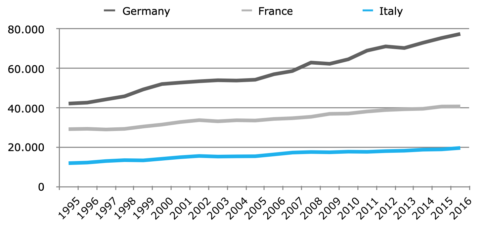
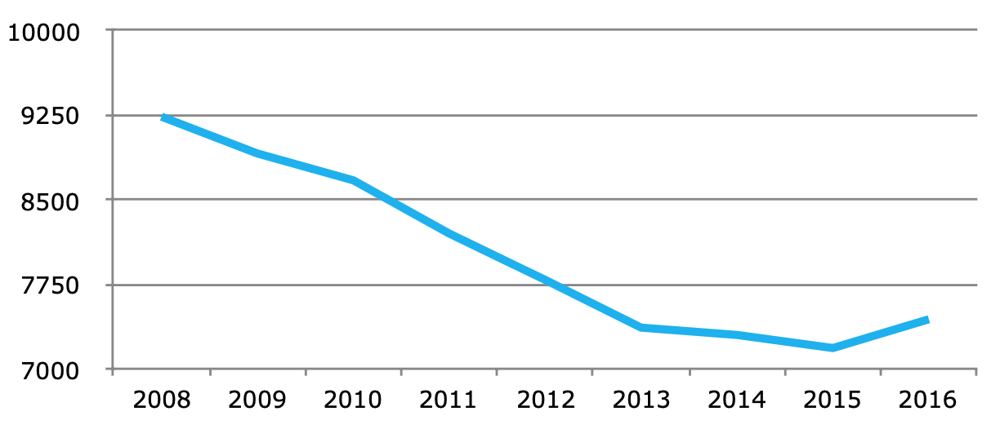

# Ricerca e Innovazione in Italia

Il sistema italiano di Ricerca e Innovazione si trova a un punto di svolta. Gli ultimi dieci anni di crisi hanno ulteriormente aggravato le debolezze tradizionali legate alle limitate attività tecnologiche del Paese. Tali debolezze sono note da anni: bassa intensità di R&S, specializzazione produttiva in settori maturi, poche grandi e medie imprese, scarsa presenza nei settori dell'alta tecnologia, acquisizione di molte aziende italiane nei settori più innovativi da parte di gruppi multinazionali stranieri, difficoltà a finanziare le spese per l'innovazione, bassa spesa pubblica per R&S e per l’università, modesta percentuale di laureati nella popolazione, forte polarizzazione territoriale tra alcune aree tecnologicamente avanzate nel Nord Italia e il resto del Paese.

Gli effetti della crisi hanno introdotto ulteriori elementi di fragilità nel sistema: le imprese hanno subito perdite consistenti di produzione e la riduzione degli investimenti ha indebolito le capacità del Paese; spesso l'introduzione delle innovazioni è stata ritardata in attesa di una ripresa della domanda che solo da poco ha registrato qualche aumento. I centri decisionali e le attività di ricerca di molte imprese sono stati trasferiti all'estero, le politiche di austerità hanno ridotto la spesa pubblica per la ricerca e l'università, da anni migliaia di giovani ricercatori e laureati altamente qualificati lasciano il Paese per cercare lavoro all'estero. Il risultato del "decennio perduto" è un ulteriore indebolimento strutturale del sistema di Ricerca e Innovazione dell'Italia.

Negli ultimi due anni le politiche per Ricerca e Innovazione hanno registrato alcuni sviluppi con l’approvazione, tardiva, del Programma nazionale della ricerca 2015-2020, il lancio di Industria 4.0, l’estensione degli incentivi fiscali per la R&S privata per il periodo 2015-2020, la strategia di specializzazione intelligente nazionale, i finanziamenti per le università meritevoli in base ai risultati della valutazione della qualità della ricerca.

Tuttavia, la crescita della spesa totale per R&S è stata modesta e l'ammontare delle risorse pubbliche è stato notevolmente ridotto dall'inizio della crisi: dal 2008 al 2016 la spesa pubblica per R&S è diminuita in termini reali del 20% e dal 2008 al 2014 la spesa pubblica per le università statali è stata ridotta del 14%.

La figura 1 mostra l’andamento della spesa totale per R&S in Italia, Francia e Germania in termini reali tra il 1995 e oggi. La divaricazione delle attività è diventata significativa con un ritardo italiano che si va allargando.

La figura 2 mostra la caduta degli stanziamenti di spesa pubblica per R&S che risente direttamente delle politiche di austerità introdotte nell’ultimo decennio e che è alla radice dell’aggravarsi del ritardo italiano in questo campo. Con la crisi, il divario con i maggiori Paesi europei si è ulteriormente ampliato per molti indicatori quali la spesa privata in R&S, il numero di studenti dell’università e i laureati.

Oltre alla scarsità di risorse, le recenti politiche per la ricerca e l'innovazione presentano alcuni aspetti problematici. Non esiste una politica della domanda pubblica che sostenga la ricerca e gli investimenti innovativi delle imprese. Gli incentivi per la ricerca e l’acquisto di nuovi macchinari restano misure "orizzontali", che mantengono il modello di politica industriale degli ultimi decenni, inadeguato a indirizzare le imprese ad acquisire le competenze tecnologiche per competere in settori chiave. Le politiche recenti per l’università e il programma Industria 4.0 hanno quantomeno individuato aree prioritarie su cui concentrare le risorse, ma si rivolgono a un numero troppo ristretto di imprese già attive nel campo dell’innovazione digitale. Insieme alle politiche recenti per l’università esse possono alimentare la polarizzazione del sistema, rafforzando poche eccellenze ma lasciando scivolare indietro il resto del sistema. Da questa analisi della politica di Ricerca e Innovazione dell'Italia scaturiscono quattro interrogativi.

## Le imprese italiane possono crescere senza tecnologia?

Nonostante la presenza di un gruppo significativo di imprese innovative capaci di esportare, l'economia italiana è caratterizzata da un ampio numero di micro imprese e di piccole imprese con limitatissime attività di R&S. La concentrazione industriale nelle attività tipiche del "Made in Italy" è generalmente associata ad attività a bassa e media tecnologia. Rispetto ai principali Paesi dell'UE la struttura economica dell'Italia continua a registrare una scarsa presenza nei settori ad alta tecnologia. Ci si può chiedere se queste caratteristiche delle aziende italiane rappresentino un limite strutturale alle possibilità di crescita economica.

È interessante il confronto tra Germania e Italia riguardo all’evoluzione di lungo termine dell’intensità di ricerca e di crescita economica. La figura 3 mostra la spesa in R&S per dipendente e la crescita del valore aggiunto reale nei settori industriali per il periodo 1995-2014.

I settori manifatturieri sono stati aggregati in: settori basati sulla scienza, produttori di macchinari, a intensità di scala e settori tradizionali. Da tale figura si nota un doppio divario tra Italia e Germania, in qualche modo rappresentativo del contrasto più ampio tra centro e periferia dell'Europa. Il divario nella spesa per R&S per dipendente mostra il ritardo delle imprese italiane rispetto a quelle tedesche in tutti i settori. In particolare, nel settore basato sulla scienza le imprese italiane registrano un'intensità di spesa per R&S pari a circa la metà delle imprese tedesche; tale divario si ritrova in tutte le aggregazioni settoriali. Le imprese tedesche investono in ricerca molto di più delle imprese italiane anche nei settori tradizionali, nonostante questi siano al centro della specializzazione produttiva italiana.

Un secondo divario riguarda la crescita: il tasso di crescita del valore aggiunto reale in Germania è sempre due o tre volte maggiore dell'Italia. L’evidenza empirica mostra come la tecnologia sia importante per la crescita di entrambi i Paesi data la chiara relazione positiva fra gli investimenti in ricerca e crescita, ma Germania e Italia sembrano muoversi in due contesti differenti. In Germania le imprese nei settori basati sulla scienza, grazie a investimenti massicci per R&S, hanno registrato una crescita media vicina al 6% annuo da circa due decenni - una crescita vicina al livello dei Paesi dell'Asia orientale. I settori industriali tedeschi con le peggiori performance crescono al 3%, una crescita maggiore dei settori con le migliori performance in Italia. Tali dinamiche divergenti segnalano l’emergere di una nuova gerarchia nella tecnologia e nell'industria, e pongono importanti questioni sulla coerenza e coesione dell'economia europea \[1\].

La questione se le imprese italiane possano sopravvivere e crescere senza puntare in maniera adeguata su investimenti in tecnologia è diventata di drammatica attualità. In realtà già oltre vent'anni fa, nel 1996, sostenevamo che "stiamo affrontando un indebolimento della base tecnologica dell'industria italiana, che aumenta il divario tra gli indicatori tecnologici \(...\). Con tale dinamica l'Italia perde terreno rispetto al circolo virtuoso tra tecnologia, crescita e occupazione comune ad altri Paesi avanzati”.

All'indomani della crisi valutaria del 1992 e della ripresa basata sulle esportazioni grazie a un deprezzamento del 30% del tasso di cambio della lira, abbiamo sostenuto che "la svalutazione, la crescita trainata dalle esportazioni, il consolidamento nei settori industriali tradizionali e la riduzione del peso della tecnologia possa essere considerato un effetto della mancata espansione della presenza italiana nei settori ad alta tecnologia negli anni Ottanta". Il risultato è stato che "tra il 1980 e il 1994, l'occupazione nell'industria è diminuita di 1,4 milioni di posizioni lavorative, quasi un quarto del totale. Dopo la recessione degli anni Novanta, l'effetto combinato della fragilità tecnologica dell'industria, delle innovazioni labour saving, della divisione internazionale della produzione e della concorrenza in mercati più aperti potrebbe comportare un impatto ancora più profondo sul declino della produzione industriale e dell'occupazione in Italia".

## La ricerca pubblica può sopravvivere con finanziamenti pubblici insufficienti?

Nell'ultimo decennio il sistema pubblico di Ricerca e Innovazione è stato indebolito dalle politiche di austerità che hanno colpito la spesa pubblica anche in questo settore. I fondi per l’università, gli enti pubblici di ricerca e il finanziamento della R&S privata e dell’innovazione evidentemente non rientravano tra le priorità politiche degli ultimi governi. La diminuzione del 19% in termini reali tra il 2008 e il 2016 degli stanziamenti pubblici per la ricerca - documentata nella precedente figura 2 - non trova eguali in Europa \(a parte le economie in crisi, come la Grecia\). Tale riduzione della ricerca pubblica e delle attività universitarie ha aggravato il rischio di perdere la massa critica necessaria per garantire qualità alla scienza e alla tecnologia. Paradossalmente i tagli hanno colpito proprio nel periodo in cui i ricercatori italiani, in gran parte delle università pubbliche, hanno registrato un elevato miglioramento della produzione scientifica. Come mostrato nella figura 4 la produttività scientifica in l'Italia, misurata dal numero di articoli scientifici \(e/o dalle citazioni ricevute\) per milione di spesa in R&S, è elevata e in crescita; questo è uno dei pochi indicatori in cui il Paese si trova dietro al Regno Unito e davanti alla Francia e alla Germania.


1. Celi G., et al., Crisis in the European Monetary Union. A Core-Periphery Perspective, 2018 Routledge, London.


