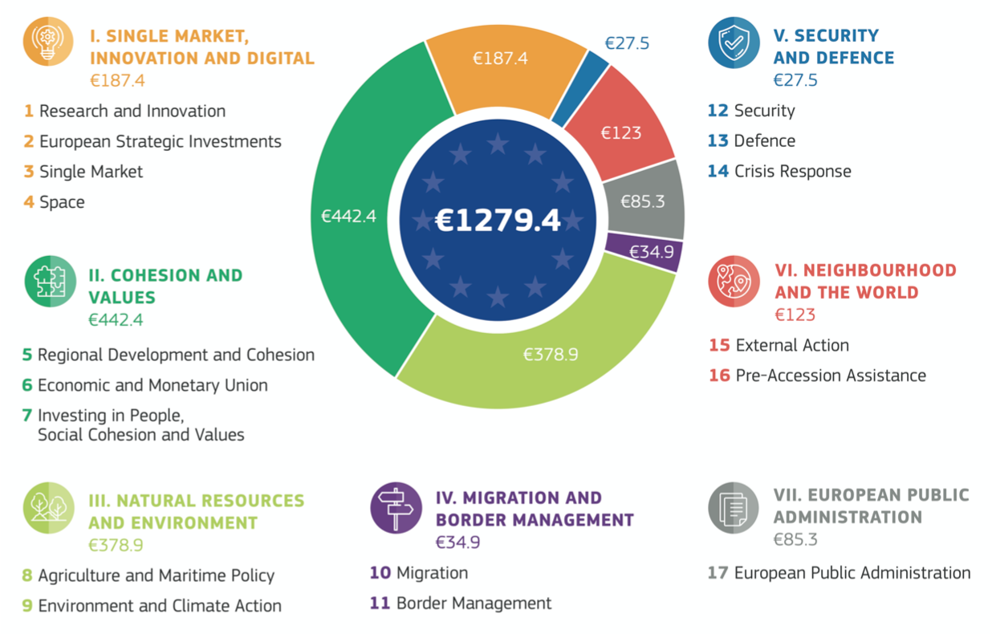
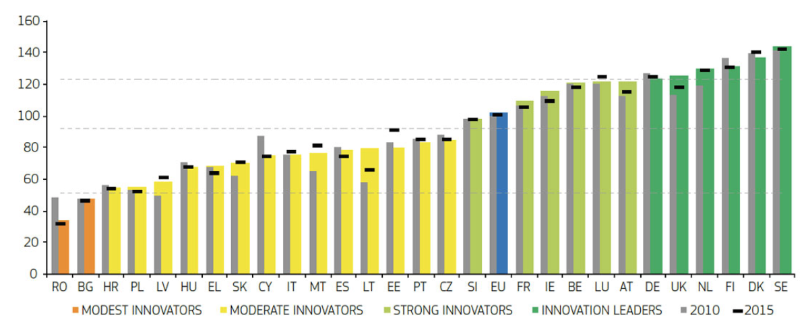
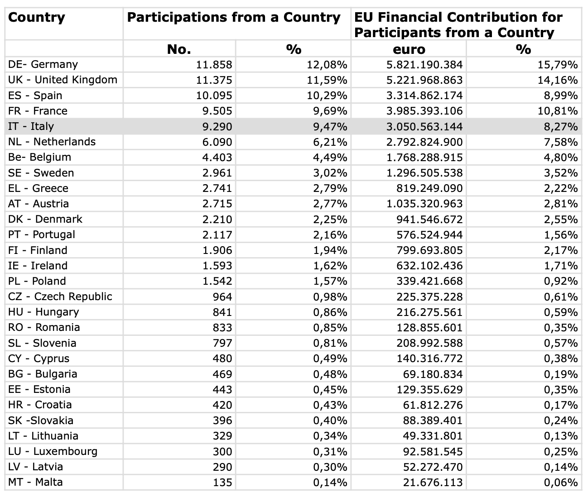
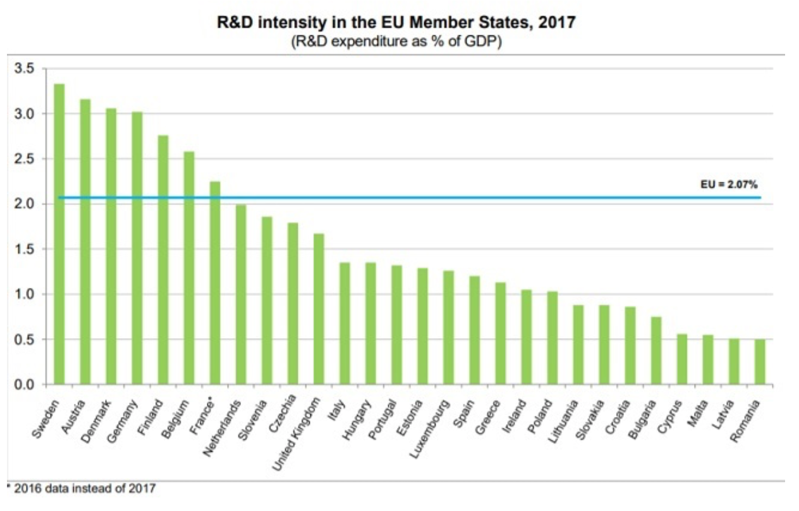

# Ricerca e Innovazione in Europa

A giugno 2018 la Commissione Europea ha presentato al Parlamento e al Consiglio Europeo la proposta per il prossimo Programma quadro per Ricerca e Innovazione che, con una dotazione finanziaria di quasi 100 miliardi di euro, ci accompagnerà dal 2021 al 2027. Si tratta di un’opportunità importante sia per il futuro dell’Europa nel suo complesso, sia per l’Italia e il suo noto deficit di investimenti in ricerca. Come vedremo, l’investimento che si prefigura per il prossimo settennio non ha soltanto un significato scientifico: esso fa parte di un bilancio molto ambizioso che rappresenta – se così si può dire – una scommessa esistenziale per l’Europa, turbata in tempi recenti da tensioni e tentazioni di disimpegno da parte di alcuni Paesi. Anche per l’economia il nuovo Programma Quadro rappresenta l’occasione di consolidare le basi per una nuova imprenditorialità capace di reggere il passo della attuale competizione internazionale.

## Il nuovo bilancio europeo e la sfida della Brexit

La dotazione finanziaria del programma Horizon Europe \(94 miliardi proposti\), è necessariamente legata all’approvazione del Quadro finanziario pluriennale 2021-2027 proposto dalla Commissione al Consiglio Europeo. La proposta per i prossimi sette anni è particolarmente ambiziosa e deve affrontare la difficile sfida di “fare di più con meno” \(con l’uscita del Regno Unito\). Ci si aspetta che l’Unione Europea svolga un ruolo più importante in nuovi ambiti d'intervento, come la migrazione, la sicurezza interna ed esterna o la difesa, mantenendo al contempo un ruolo di rilievo sulla scena mondiale. Questi obiettivi devono essere raggiunti con una dotazione complessiva destinata a diminuire con l'uscita del Regno Unito. La proposta di bilancio, piuttosto ambiziosa se comparata a quella corrente è quindi concepita in vista di una futura Europa a 27 e in uno scenario globale in mutamento. Si attesta su 1.279,4 miliardi di euro di impegni, ovvero l’1,114% del Reddito nazionale lordo degli stati membri,1 laddove il bilancio attuale è pari allo 0,98. Si è quindi superata la soglia psicologica dell’1%. Tenuto conto del disimpegno UK, che rappresenta quasi il 13% del budget \(più o meno 13 miliardi di euro nell’attuale budget europeo\), occorrerà un grande sforzo dei 27 Paesi per colmare questo vuoto, ma soprattutto servirà una piena condivisone delle priorità politiche dell'UE proposte nel nuovo bilancio.2

Al centro del dibattito emergono alcune questioni fondamentali tra loro correlate. Prima di tutto quale debba essere la finalità del bilancio europeo, e quindi come garantire che la spesa gestita dall’Europa produca risultati aggiuntivi per i cittadini europei rispetto alle politiche nazionali. Ne consegue che la domanda di fondo sia come ripartire il bilancio dell’UE per assicurare che le risorse siano destinate ai bisogni della società civile. La risposta dell’esecutivo comunitario è schematizzata nella figura 1 che segue.

Rispetto all’esercizio precedente e in linea con i tentativi di modernizzazione, il Capitolo III “Agricoltura e risorse naturali”, pur restando la seconda voce del bilancio per quantità di fondi allocati è stato ridotto, anche se 10 miliardi di Horizon Europe sono già destinati a ricerca in Agricoltura proprio in direzione di un budget più innovativo. Come sempre la Politica di Coesione \(Capitolo II\) è la voce più consistente del bilancio, anche se ci saranno maggiori obblighi di indirizzare parte delle risorse a infrastrutture di ricerca \(sulla scorta della Smart Specialization Strategy\). Ricerca e Innovazione \(Capitolo 1\) hanno avuto un incremento sia in termini di budget sia di rilevanza strategica e, come sempre, costituiscono la terza voce del bilancio europeo. Sotto lo stesso capitolo sono stati collocati gli strumenti a favore delle PMI \(il Single Market che sostituisce COSME\), il programma di Investimenti strategici \(meglio noto come Piano Juncker\) e lo Spazio, settore in cui l’Italia gioca un ruolo di primo piano e che, con l’uscita del Regno Unito, potrà costituire un’opportunità ancora maggiore. C’è inoltre da ricordare che nel Capitolo V \(Sicurezza e Difesa\), ci sono ingenti risorse per la ricerca in questi settori, che si aggiungono a quelle già destinate alla sicurezza dual use3 per scopi civili in Horizon Europe.

Resta fermo che il budget complessivo e la sua ripartizione riportati nella figura 1 costituiscono solo la proposta della Commissione, e che saranno gli Stati membri nei prossimi mesi a definire la dotazione e l’allocazione delle risorse nei sette capitoli. Come anticipato in premessa, lo scenario nel quale questo negoziato avverrà è tutt’altro che roseo. Ci sono infatti molti governi agitati da crescenti sentimenti sovranisti ed euroscettici, che non nascondono la tentazione di seguire la stessa strada del Regno Unito o che comunque considerano l’UE una sorta di menù dove scegliere solo alcune “portate”, perdendo di vista il principio di sussidiarietà che è il fondamento dell’idea dell’Unione Europea. Assisteremo quindi al consueto scontro tra i Paesi “rigoristi” favorevoli a ridurre la percentuale di contributo al budget, come Belgio, Danimarca, Paesi Bassi, Svezia \(in sostanza quelli che investono di più e quindi più vicini al capitolo Competitività\), Paesi “like minded” inclini a mantenere lo status quo \(tradizionalmente Francia, Germania e Italia\) e gli “amici della Coesione” \(tipicamente i nuovi entrati\). Tutti comunque si affanneranno a congetturare se ci sarà maggiore ritorno rinforzando la Politica Agricola e la Coesione \(che sono ad allocazione prestabilita\) o la Competitività \(che è per sua natura con ritorno incerto\). Con queste premesse, alle quali si aggiunge l’incognita Brexit, non è affatto certo che dimensione finale assumerà entro la fine del 2019 il Quadro finanziario pluriennale 2021-2027. Lo scenario è reso ancor più incerto dalle elezioni europee di metà 2019 che potrebbero restituirci un Parlamento profondamente modificato negli equilibri e permeato di quelle derive sovraniste che non aiutano il progetto europeo.

Un altro elemento che possiamo identificare come critico in questa fase di negoziato è la perdurante dicotomia tra i due blocchi di Paesi, riconducibili agli EU 15 \(i vecchi Stati membri\) e gli EU 13 \(i nuovi entrati\). Questa spaccatura, nella visione del nuovo Programma Quadro Horizon Europe, si sostanzia con un maggiore o minore favore alla dimensione dell’eccellenza scientifica \(della quale sono paladini gli EU 15\) e a un maggiore o minore ricorso a misure di riequilibrio delle eccellenze4 spinte con decisione dai nuovi Stati membri.

L’evidenza di questo gap è fornito da un indicatore complesso adottato dall’UE – l’European Innovation Scoreboard – che analizza la performance degli Stati membri, e li aggrega in 4 categorie in funzione delle capacità in Ricerca e Innovazione. Come si evince dalla figura 2, gli EU 15 \(con eccezione della Slovenia\) si trovano nel blocco dei Paesi sotto- performanti \(modest o moderate innovators\), in compagnia di Italia, Portogallo e Spagna. E comunque al di sotto della media UE.

Se confrontiamo i dati della figura 2 con gli investimenti nazionali in Ricerca e Innovazione \(figura 3\), emerge chiaramente che le due dimensioni sono per lo più sovrapponibili e i Paesi a bassa capacità innovativa sono gli stessi che investono meno in Ricerca e Sviluppo.

Se aggiungiamo poi la terza dimensione, ovvero le capacità dei 28 Paesi di recuperare fondi e progetti da Horizon 2020, ancora una volta i conti tornano e il ranking della figura 4 rispecchia gli investimenti e l’intensità in Ricerca e sviluppo.

## Il Programma Quadro Horizon Europe

A un primo sguardo, la proposta del nuovo programma sembra ricalcare la struttura dell’attuale Horizon 2020, in linea con la filosofia evolution not revolution sostenuta nei mesi scorsi dal Commissario per la ricerca Carlos Moedas. In realtà il nuovo Programma Quadro cambia profondamente in funzione dell’agenda europea, senz’altro più incline che in passato a sostenere la parte di ricerca più vicina al mercato che quella precompetitiva e a produrre effetti più immediati su crescita e occupazione. Peraltro, è tutta l’attuale Commissione Juncker \(e non soltanto il portafoglio ricerca\) ad essere decisamente orientata verso il ritorno economico e la razionalizzazione finanziaria e legislativa. Non è un caso se tutte le attività dei Commissari Europei sono state vincolate all’approvazione dei due Vicepresidenti, responsabili per better spending \(Jyrki Katainen\) e better regulation \(Frans Timmermans\). Di fatto, ogni dossier proposto dai vari servizi della Commissione deve preventivamente rispondere alle domande: a\) quanto costa e che ritorno genera all’UE; b\) è necessario uno strumento legislativo?

Il Commissario alla ricerca Moedas ha rilevato che in Europa c’è molta ricerca di qualità ma poca innovazione dello stesso tenore, e solo poche imprese da un miliardo di dollari - le cosiddette unicorn - sono nate in Europa. La volontà della Commissione è quindi di facilitare il potenziamento delle imprese accompagnandole in questo percorso anche con strumenti finanziari. A questo programma si potrebbe obiettare che le condizioni quadro europee non sono favorevoli a questo processo dai punti di vista normativo, burocratico e finanziario, e che per molti commentatori non pare appropriato investire di queste aspettative un programma europeo destinato alla ricerca. Di questo argomento si era già discusso nel 2014 durante il semestre di presidenza italiana del Consiglio dell’UE5 e si evidenziò la necessità di affrontare in primo luogo le condizioni di contorno per favorire l’innovazione.Grazie a una efficace attività di lobby a Bruxelles, questi temi sono prepotentemente entrati nell’agenda dell’UE e “la nuova Agenda per Ricerca e Innovazione”6 che i capi di Stato e di governo hanno adottato lo scorso 16 maggio a Sofia, in occasione del Vertice informale sotto la presidenza bulgara, contiene una serie di azioni concrete e alcune indicazioni per il futuro dell’Unione. Tutti concordano sul fatto che investire in Ricerca e Innovazione voglia dire investire nel futuro dell'Europa, competere a livello globale e preservarne il modello sociale. La ricerca migliora la vita quotidiana di milioni di persone in Europa e nel mondo, aiutando a risolvere alcune delle nostre più grandi sfide sociali e generazionali. Anche il Vicepresidente della Commissione Jyrki Katainen, responsabile per l'occupazione, la crescita, gli investimenti e la competitività, ha rimarcato come l'Europa abbia una ricerca di livello mondiale e una solida base industriale, ma che occorra fare molto di più per trasformare questa eccellenza in successo. Nuovi filoni di ricerca \(EC megatrend\) come l’intelligenza artificiale e l’economia circolare stanno portando profondi cambiamenti nella società e nell’economia, e l’Europa deve essere in grado di guidare questa nuova ondata di innovazione se vuole restare competitiva al livello globale.

La risposta a questo invito è stata raccolta dal Gabinetto ricerca con l’ambiziosa proposta di Horizon Europe, che dovrà però fare i conti con l’attuale tiepido sentimento europeo dei 28 Paesi, per conservare il budget di 100 miliardi proposto dalla Commissione. Forse solo Moedas, grazie alla sua profonda esperienza sia politica sia finanziaria,7 ha intuito la necessità di riforme strutturali nei singoli Stati per sostenere l’innovazione. Il punto dolente è che per Moedas l’innovazione è solo quella distruptive e non quella incrementale, sicuramente più consona al tessuto produttivo europeo, con poche eccezioni tra cui Francia e Germania che invece vengono accontentate nella loro iniziativa bilaterale per supportare l’innovazione breakthrough \(l’iniziativa francese, annunciata dal presidente Emanuel Macron all’inaugurazione dell’anno accademico alla Sorbona, si chiama JEDI8\). Ed è proprio per evitare fughe in avanti di alcuni Paesi che il commissario Moedas ha ritagliato il futuro European Innovation Council – EIC, che dovrà finanziare le attività vicino al mercato in Horizon Europe - sulle esigenze di chi quel tipo di innovazione è in grado fin da ora di perseguirla e sostenerla.

La riflessione è che il programma Horizon Europe nasce viziato da ambizioni che difficilmente troveranno riscontro nella dimensione europea, a causa dei sopra menzionati problemi strutturali-normativi- burocratici e da una modesta cultura del venture capital. Resta inoltre il dubbio se un Programma Quadro debba erogare fondi, anche con strumenti finanziari, ad attività molto vicine al mercato, che in caso di beneficiario unico potrebbero configurarsi come aiuto di stato camuffato.

La proposta che ora si trova in negoziato tra i due co-legislatori è purtroppo condizionata da uno scenario EU tutt’altro che agevole e che rischia di dominare il dibattito \(che invece dovrebbe essere costruttivo\) tra il 28 Stati membri, l’esecutivo UE e il Parlamento. Come avremo modo di vedere più avanti, non si tratta di elementi specifici del settore ricerca, quanto di fondamenti strutturanti dell’UE e che minacciano la sua tenuta.

Tutti i dossier in discussione in ognuna delle filiere del Consiglio, siano esse finanziarie \(budget, concorrenza\), geografiche \(migrazione, rapporti tra i 28 Stati membri e tra UE e Paesi terzi\) o tematiche \(agenda digitale, energia, trasporti, ambiente, ricerca\), sono subordinati ad alcuni elementi dirimenti: la Brexit, la stabilità finanziaria dell’UE, l’euroscetticismo, le future elezioni del Parlamento Europeo e l’insediamento della nuova Commissione Europea. Alcuni di questi elementi sono intrinsecamente legati tra loro e non prescindono dalla posizione, formale e sostanziale, che ciascuno Stato membro sta assumendo nei confronti dell’Europa

## Opportunità per l’Italia - verso il prossimo Programma Quadro

Dai dati sopra esposti emerge piuttosto chiaramente che l’Italia ha avuto, in Horizon 2020, una performance in linea con il suo impegno in Ricerca e Innovazione, in termini di investimenti e di capacità innovativa. In assoluto giocano a sfavore alcuni elementi: a\) l’Italia è un grande contributore al bilancio UE e b\) i costi salariali dei ricercatori sono ben al di sotto degli omologhi dei Paesi con i quali ci confrontiamo direttamente; c\) la “massa critica” ovvero il numero di ricercatori e scienziati in percentuale alla forza lavoro \(vedi figura 5\).

Ne consegue che le Organizzazioni di altri Stati membri, ad esempio il CNRS in Francia o il Max Planck in Germania, oltre alle già discusse condizioni di contorno favorevoli, potendo contare su un volume di ricercatori doppio o triplo rispetto a un CNR italiano \(e con salari di tutto rispetto\), hanno maggiori chance di successo nella programmazione UE. La cartina al tornasole di questa analisi è nella figura 4 dove la Germania, con un numero di partecipazioni poco superiore alla nostra, riporta a casa quasi il doppio di finanziamenti. Gli stakeholder italiani godono in realtà di una eccellente e meritata reputazione e sono spesso richiesti nei partenariati proprio in virtù della qualità che conferiscono al progetto. Dal punto di vista dell’eccellenza quindi non abbiamo avuto debolezze e non ne avremo probabilmente in futuro.

Occorre però tenere in considerazione che il nuovo Programma quadro si sta profilando più verso l’Innovazione che verso la Ricerca: confidando nelle capacità di adattamento del nostro sistema ricerca, sarà necessario sfruttare al meglio i prossimi due anni \(e i prossimi bandi pilota di Horizon 2020\) per farci trovare pronti al cambio di paradigma.

## Conclusioni

È evidente che per mantenere alte le giuste ambizioni di un Paese membro del G7 sono necessari interventi che mettano la ricerca e il relativo capitale umano al centro delle politiche nazionali.

Ci sono elementi che potrebbero tornare utili per sostenere in ogni sede opportuna la necessità di rinforzare l’impegno nazionale in Ricerca e Innovazione, ma anche di dedicare la giusta parte di budget quando si andrà a negoziare a Bruxelles il bilancio UE 2021-27.

La ricerca ha un ruolo chiave nella creazione di un'Europa unita.

Sono fermamente convinto del ruolo che la ricerca potrebbe svolgere nel rafforzare la stabilità dell'Unione Europea. Scienziati provenienti da diversi Stati, infatti, cooperano tra loro indipendentemente dalle buone o cattive relazioni tra i rispettivi Paesi. In alcuni casi le relazioni tra team scientifici di differenti Paesi hanno facilitato l’avvicinamento tra i rispettivi governi. La diplomazia scientifica ha contribuito a rafforzare le relazioni tra Paesi, indipendentemente da differenze religiose, politiche o strutturali. A questo fine sarebbe importante concepire la ricerca come elemento centrale dei programmi nazionali e a livello europeo, in termini di importanza e risorse finanziarie.

In questo momento storico non esiste alternativa all'eccellenza.

L'eccellenza è una sfida impegnativa, che a volte può sembrare eccessiva o discriminatoria. Tuttavia, è un passaggio inevitabile se l'Europa vuole rimanere tra i centri di ricerca più attraenti e competitivi a livello mondiale. Pertanto, l'eccellenza deve essere promossa come una priorità integrativa e diffusa in tutta Europa con ogni mezzo idoneo, non solo nella qualità della ricerca ma anche negli aspetti gestionali.

La ricerca può offrire un sostegno alle decisioni politiche. La ricerca dovrebbe fornire agli organi di governo il supporto scientifico al fine di operare le scelte migliori. Questo ruolo contribuisce a contrastare il clima di disinformazione e impedire interpretazioni dei fatti sociali ed economici non sostenute da evidenze. L'obiettivo della scienza è infatti universale, promuove l’uguaglianza e contrasta le discriminazioni. Sarebbe ottimo se la ricerca potesse offrire il proprio sostegno anche al sistema politico nazionale dell'Unione affinché si adottino decisioni knowledge based per affrontare le grandi sfide della società. Pensiamo a grandi temi come quello del cambiamento climatico o dell’Intelligenza artificiale che senz’altro devono essere affrontati sulla base di solide evidenze scientifiche e non sulla scorta di urgenze momentanee.

La ricerca è fonte di crescita e lavoro qualificato per i Paesi europei. Troppo spesso la politica ha una finestra temporale breve, e la necessità di rispondere alle esigenze correnti dei cittadini o a urgenze contingenti induce a mettere la ricerca in secondo piano. La ricerca ha infatti per sua natura una visione a lungo termine e questo può tradursi in un disinvestimento pericoloso. Infatti, i risultati ad alto contenuto di ricerca, anche se non immediati, sono duraturi, essenziali, strutturanti. La cosiddetta knowledge intensive economy è la soluzione scelta dai Paesi che hanno mantenuto alto il livello di questi investimenti e sono stati quelli più resilienti alla crisi economica.


1. In economia il Reddito nazionale lordo \(RNL\) di un Paese viene calcolato sommando al Prodotto interno lordo \(PIL\), o sottraendo da esso, vari flussi di reddito tra Paesi.
2. Con l’uscita del Regno Unito, l’UE perderà un partner di eccellenza per le sue politiche e i suoi programmi ma anche un grande contributore finanziario. Questo evento potrà costituire un momento di riflessione dell’UE sul proprio ruolo, sulla modernizzazione del bilancio e sulle misure idonee ad evitare un effetto emulazione della scelta UK.
3. Sono considerati beni e tecnologie duali quelli utilizzabili in applicazioni civili ma anche nella produzione, sviluppo e utilizzo di beni militari. Si differenziano dai materiali d’armamento in quanto non sono appositamente progettati per uso militare. Fonte MISE.
4. Misure volte a: “widening participation and spreading excellence”.
5. COM \(2014\)339 Ricerca e Innovazione come fattori di rilancio della crescita.
6. [https://ec.europa.eu/commission/sites/beta-political/files/communication-europe-](https://ec.europa.eu/commission/sites/beta-political/files/communication-europe-) chance-shape-future\_en.pdf
7. Carlos Moedas ha negoziato con la Troika CE, BCE e FMI le misure UE contro il Portogallo.


